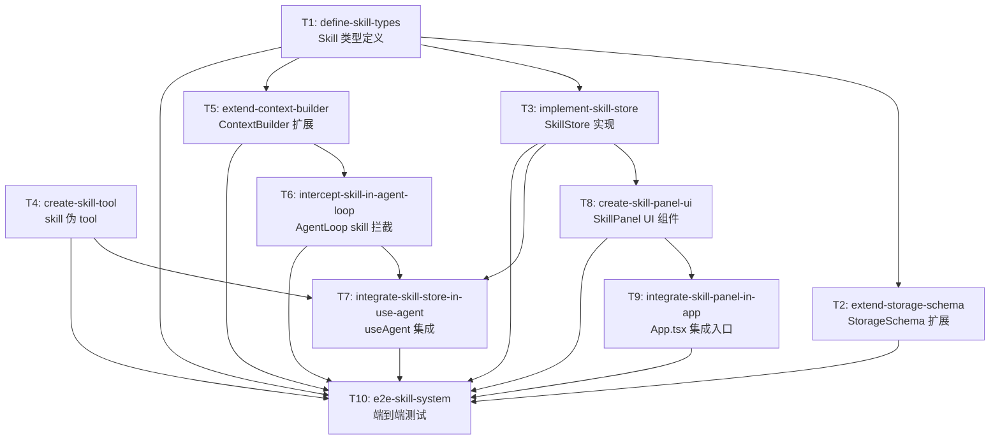

# DAG 任务图: Agent Skill System

**日期:** 2026-06-23
**技术方案:** [Agent Skill System.md](./Agent%20Skill%20System.md)
**状态:** Ready for Implementation

---

## 依赖图



---

## 批次概览

| 批次 | 任务 | 可并行 | 说明 |
|------|------|--------|------|
| Batch 1 | T1, T4 | ✅ | 纯类型定义 + 无依赖 tool 定义 |
| Batch 2 | T2, T3, T5 | ✅ | 都只依赖 T1，互不依赖 |
| Batch 3 | T6, T8 | ✅ | T6 依赖 T5，T8 依赖 T3，互不依赖 |
| Batch 4 | T7, T9 | ✅ | T7 依赖 T3/T4/T6，T9 依赖 T8，互不依赖 |
| Batch 5 | T10 | ❌ | 依赖全部完成 |

---

## 任务列表

### Batch 1（无依赖，可并行）

| Task ID | Slug | 标题 | 类型 | 涉及模块 | 预估工时 |
|---------|------|------|------|----------|----------|
| T1 | `define-skill-types` | 创建 Skill 类型定义 | backend | M1 | 0.5h |
| T4 | `create-skill-tool` | 创建 skill 伪 tool 定义 | backend | M4 | 0.5h |

### Batch 2（依赖 T1，可并行）

| Task ID | Slug | 标题 | 类型 | 涉及模块 | 预估工时 |
|---------|------|------|------|----------|----------|
| T2 | `extend-storage-schema` | 扩展 StorageSchema 增加 skills 字段 | backend | M3 | 0.5h |
| T3 | `implement-skill-store` | 实现 SkillStore 持久化层 | backend | M2 | 1.5h |
| T5 | `extend-context-builder` | 扩展 ContextBuilder 支持 skill 注入 | backend | M5 | 1.5h |

### Batch 3（依赖 Batch 2，可并行）

| Task ID | Slug | 标题 | 类型 | 涉及模块 | 预估工时 |
|---------|------|------|------|----------|----------|
| T6 | `intercept-skill-in-agent-loop` | AgentLoop 中拦截 skill tool call | backend | M6 | 2h |
| T8 | `create-skill-panel-ui` | 创建 SkillPanel UI 组件 | frontend | M7 | 2.5h |

### Batch 4（依赖 Batch 3，可并行）

| Task ID | Slug | 标题 | 类型 | 涉及模块 | 预估工时 |
|---------|------|------|------|----------|----------|
| T7 | `integrate-skill-store-in-use-agent` | useAgent 中集成 SkillStore | fullstack | M8 | 1.5h |
| T9 | `integrate-skill-panel-in-app` | App.tsx 中集成 SkillPanel 入口 | frontend | M7 | 0.5h |

### Batch 5（依赖全部完成）

| Task ID | Slug | 标题 | 类型 | 涉及模块 | 预估工时 |
|---------|------|------|------|----------|----------|
| T10 | `e2e-skill-system` | 端到端测试 Skill 完整流程 | fullstack | 全部 | 2h |

---

## 任务详情

---

### T1: 创建 Skill 类型定义

- **Slug:** `define-skill-types`
- **类型:** backend
- **依赖:** 无
- **涉及模块:** M1
- **预估工时:** 0.5h

**描述:**

创建 `src/shared/types/skill.ts`，定义 `Skill` 接口和 `ISkillStore` 接口，并在 `src/shared/types/index.ts` 中导出。

**关键接口:**

```typescript
// src/shared/types/skill.ts
export interface Skill {
  id: string;
  name: string;
  description: string;
  prompt: string;
  enabled: boolean;
  createdAt: number;
  updatedAt: number;
}

export interface ISkillStore {
  getAll(): Promise<Skill[]>;
  getEnabled(): Promise<Skill[]>;
  save(skills: Skill[]): Promise<void>;
  add(skill: Skill): Promise<void>;
  update(id: string, patch: Partial<Skill>): Promise<void>;
  remove(id: string): Promise<void>;
  onChange(callback: (skills: Skill[]) => void): () => void;
}
```

**验收标准:**

- [ ] `src/shared/types/skill.ts` 文件创建，包含 `Skill` 和 `ISkillStore` 导出
- [ ] `src/shared/types/index.ts` 新增 `Skill` 和 `ISkillStore` 的 re-export
- [ ] `npx tsc --noEmit` 编译通过

**输出文件:**
- `src/shared/types/skill.ts`（新增）
- `src/shared/types/index.ts`（修改，新增 2 行 export）

**关联用户故事:** US-1（Skill 数据模型）

---

### T4: 创建 skill 伪 tool 定义

- **Slug:** `create-skill-tool`
- **类型:** backend
- **依赖:** 无（不依赖 Skill 类型，tool schema 中的 `name` 是通用 string 参数）
- **涉及模块:** M4
- **预估工时:** 0.5h

**描述:**

创建 `src/tools/skill-tool.ts`，导出一个 `createSkillTool()` 工厂函数，返回符合 `ToolDefinition` 接口的伪 tool。此 tool 不需要真正的 execute 逻辑——实际拦截在 AgentLoop 中完成。

**关键接口:**

```typescript
// src/tools/skill-tool.ts
import type { ToolDefinition } from '@/registry/types';

export function createSkillTool(): ToolDefinition {
  return {
    name: 'skill',
    description: '激活一个技能（skill），加载该技能的上下文指令。当你识别到用户意图匹配某个技能时，调用此工具激活它。可以多次调用以激活多个技能。',
    schema: {
      type: 'object',
      properties: {
        name: { type: 'string', description: '要激活的技能名称' },
      },
      required: ['name'],
    },
    category: 'expert',
    riskLevel: 'low',
    confirmationRequired: false,
    resultSensitivity: 'low',
    execute: async (params) => {
      return { success: true, data: { activated: params.name } };
    },
  };
}
```

**注意:** 此任务不负责将 tool 注册到 ToolRegistry。注册在 T7（useAgent 集成）中完成。

**验收标准:**

- [ ] `src/tools/skill-tool.ts` 文件创建
- [ ] `createSkillTool()` 返回的 ToolDefinition 符合 `ToolDefinition` 接口
- [ ] `tool.toOpenAISchema()` 输出包含 `name: "skill"` 的 function schema
- [ ] 单元测试：验证 schema 结构和 execute 返回值
- [ ] `npx tsc --noEmit` 编译通过

**输出文件:**
- `src/tools/skill-tool.ts`（新增）
- `src/tools/__tests__/skill-tool.test.ts`（新增）

**关联用户故事:** US-2（LLM 通过 function calling 激活 skill）

---

### T2: 扩展 StorageSchema 增加 skills 字段

- **Slug:** `extend-storage-schema`
- **类型:** backend
- **依赖:** T1（`define-skill-types`）
- **涉及模块:** M3
- **预估工时:** 0.5h

**描述:**

修改 `src/shared/types/storage.ts`，在 `StorageSchema` 接口中新增 `skills: Skill[]` 字段，并在 `ConfigStore` 的 `DEFAULTS` 中添加默认值 `[]`。

**改动点:**

1. `StorageSchema` 接口新增 `skills: Skill[]` 字段
2. `ConfigStore.DEFAULTS` 新增 `skills: []`

```typescript
// storage.ts
export interface StorageSchema {
  // ... 现有字段
  /** Skill 列表 */
  skills: Skill[];
}

// config-store.ts DEFAULTS 常量
const DEFAULTS: StorageSchema = {
  // ... 现有字段
  skills: [],
};
```

**验收标准:**

- [ ] `StorageSchema` 包含 `skills: Skill[]` 字段
- [ ] `ConfigStore.DEFAULTS.skills` 为 `[]`
- [ ] 现有 `ConfigStore` 单测仍然通过（新增字段不影响已有逻辑）
- [ ] `npx tsc --noEmit` 编译通过

**输出文件:**
- `src/shared/types/storage.ts`（修改，新增 2 行）
- `src/shared/storage/config-store.ts`（修改，DEFAULTS 新增 1 行）

**关联用户故事:** US-1（Skill 持久化存储）

---

### T3: 实现 SkillStore 持久化层

- **Slug:** `implement-skill-store`
- **类型:** backend
- **依赖:** T1（`define-skill-types`）
- **涉及模块:** M2
- **预估工时:** 1.5h

**描述:**

创建 `src/shared/storage/skill-store.ts`，实现 `SkillStore` 类，遵循与 `ConfigStore` 相同的单例模式。直接操作 `chrome.storage.local`，以 `skills` 为 key 存储 `Skill[]`。

**关键实现:**

```typescript
// src/shared/storage/skill-store.ts
import type { Skill, ISkillStore } from '@/shared/types/skill';

export class SkillStore implements ISkillStore {
  private static instance: SkillStore | null = null;
  private static STORAGE_KEY = 'skills';

  static getInstance(): SkillStore { /* 单例 */ }
  static resetInstance(): void { /* 测试用 */ }

  async getAll(): Promise<Skill[]> {
    const result = await browser.storage.local.get(SkillStore.STORAGE_KEY);
    return result[SkillStore.STORAGE_KEY] ?? [];
  }

  async getEnabled(): Promise<Skill[]> {
    const all = await this.getAll();
    return all.filter(s => s.enabled);
  }

  async save(skills: Skill[]): Promise<void> {
    await browser.storage.local.set({ [SkillStore.STORAGE_KEY]: skills });
  }

  async add(skill: Skill): Promise<void> {
    const all = await this.getAll();
    all.push(skill);
    await this.save(all);
  }

  async update(id: string, patch: Partial<Skill>): Promise<void> {
    const all = await this.getAll();
    const idx = all.findIndex(s => s.id === id);
    if (idx === -1) throw new Error(`Skill "${id}" not found`);
    all[idx] = { ...all[idx], ...patch, updatedAt: Date.now() };
    await this.save(all);
  }

  async remove(id: string): Promise<void> {
    const all = await this.getAll();
    await this.save(all.filter(s => s.id !== id));
  }

  onChange(callback: (skills: Skill[]) => void): () => void {
    const handler = (changes: Record<string, chrome.storage.StorageChange>) => {
      if (changes[SkillStore.STORAGE_KEY]) {
        callback(changes[SkillStore.STORAGE_KEY].newValue ?? []);
      }
    };
    browser.storage.local.onChanged.addListener(handler);
    return () => browser.storage.local.onChanged.removeListener(handler);
  }
}
```

**验收标准:**

- [ ] `SkillStore.getInstance()` 返回同一实例（单例验证）
- [ ] `getAll()` 无数据时返回 `[]`
- [ ] `add()` 后 `getAll()` 包含新 skill
- [ ] `update(id, patch)` 部分更新成功，`updatedAt` 自动更新
- [ ] `remove(id)` 后 skill 不再出现在列表中
- [ ] `getEnabled()` 只返回 `enabled: true` 的 skill
- [ ] `onChange()` 在 `chrome.storage.local` 变更时触发回调
- [ ] `onChange()` 返回的取消函数能正确取消监听
- [ ] 单元测试覆盖全部 7 个方法

**输出文件:**
- `src/shared/storage/skill-store.ts`（新增）
- `src/shared/storage/__tests__/skill-store.test.ts`（新增）
- `src/shared/storage/index.ts`（修改，新增 SkillStore 导出）

**关联用户故事:** US-1（Skill 持久化存储）

---

### T5: 扩展 ContextBuilder 支持 skill 注入

- **Slug:** `extend-context-builder`
- **类型:** backend
- **依赖:** T1（`define-skill-types`）
- **涉及模块:** M5
- **预估工时:** 1.5h

**描述:**

修改 `src/agent/context-builder.ts`，在 `build()` 方法中新增两个可选参数 `activeSkillNames` 和 `allSkills`，在 system prompt 中注入可用技能列表和已激活技能的 prompt。

**改动点:**

1. `build()` 签名新增参数（保持向后兼容——默认 `undefined`）：

```typescript
async build(
  conversationId: string,
  currentBrowserContext: LowSensitivityContext,
  activeSkillNames?: string[],
  allSkills?: Skill[],
): Promise<ChatMessage[]>
```

2. System prompt 构建顺序调整为：

```
1. 基础 system prompt（this.config.systemPrompt）
2. 可用技能列表（仅当 allSkills 非空时注入）
3. 已激活技能 prompt（仅当 activeSkillNames 非空时注入）
4. Available Tools（现有逻辑）
5. Conversation Summary（现有逻辑）
6. Browser Context（现有逻辑）
7. Recent Messages（现有逻辑）
```

3. 注入格式：

```
## 可用技能

你可以使用 `skill` 工具激活以下技能。激活后，技能的指令会注入到你的系统提示中。

- {name}: {description}
- ...

## 已激活的技能

### {name}
{prompt}

### {name}
{prompt}
```

**验收标准:**

- [ ] 不传 `activeSkillNames` 和 `allSkills` 时，输出与修改前完全一致（向后兼容）
- [ ] 传入 `allSkills` 时，system prompt 包含 "## 可用技能" 章节
- [ ] 传入 `activeSkillNames` 匹配的 skill 时，system prompt 包含 "## 已激活的技能" 章节及对应 prompt 内容
- [ ] 传入不匹配的 `activeSkillNames` 时，不注入该 skill（静默忽略）
- [ ] 单元测试：验证每种组合的 system prompt 输出
- [ ] 现有 `context-builder.test.ts` 全部通过

**输出文件:**
- `src/agent/context-builder.ts`（修改）
- `src/agent/__tests__/context-builder.test.ts`（修改，新增 skill 注入测试用例）

**关联用户故事:** US-2（LLM 获得 skill 上下文指令）

---

### T6: AgentLoop 中拦截 skill tool call

- **Slug:** `intercept-skill-in-agent-loop`
- **类型:** backend
- **依赖:** T5（`extend-context-builder`）
- **涉及模块:** M6
- **预估工时:** 2h

**描述:**

修改 `src/agent/agent-loop.ts`，在 `run()` 方法中：
1. 接收 `allSkills: Skill[]` 参数
2. 维护 `activeSkillNames: Set<string>`（每轮 `run()` 调用时初始化为空）
3. 在 tool call 处理循环中，`getTool(name)` 之后、guardrail 之前，判断是否为 `skill` tool：
   - 匹配 skill → 加入 `activeSkillNames`，伪造 tool result，`continue` 跳过 guardrail 和 execute
   - 不匹配 → 返回错误 tool result
4. 每轮开始时重新调用 `contextBuilder.build()`，传入当前 `activeSkillNames` 和 `allSkills`

**关键逻辑位置**（在 `agent-loop.ts` 第 179 行 `getTool()` 之后、第 203 行 guardrail 之前插入）：

```typescript
// 在 getTool(tc.function.name) 之后立即插入：

// Skill tool 拦截：不经过 guardrail/execute，直接在 AgentLoop 中处理
if (tc.function.name === 'skill') {
  const skillName = params.name as string;
  const matchedSkill = this.allSkills.find(s => s.name === skillName);
  const result = matchedSkill
    ? { success: true, data: { activated: skillName } }
    : { success: false, error: `技能 "${skillName}" 不存在` };

  if (matchedSkill) {
    activeSkillNames.add(skillName);
  }

  toolCalls.push({
    toolName: 'skill', params, result,
    riskLevel: 'low', confirmed: false,
    timestamp: Date.now(), toolCallId: tc.id,
  });

  const toolMsg = {
    role: 'tool' as const,
    tool_call_id: tc.id,
    content: JSON.stringify(result),
  };
  messages.push(toolMsg);
  await this.conversationManager.addMessage(input.conversationId, {
    id: crypto.randomUUID(), role: 'tool',
    content: toolMsg.content, toolCallId: tc.id, timestamp: Date.now(),
  });
  this.hooks?.onToolCall?.(toolCalls[toolCalls.length - 1]);
  continue; // 跳过 guardrail + execute
}
```

同时，`messages` 初始化时需要调用新的 `build()` 签名：

```typescript
// 原: let messages = await this.contextBuilder.build(conversationId, ctx);
// 改为在每轮开始时重新构建：
// 在 while 循环第一行（第 78 行之前）：
const messages = await this.contextBuilder.build(
  input.conversationId, input.browserContext,
  [...activeSkillNames], this.allSkills,
);
```

**注意:** 这意味着 `messages` 的初始化要从 while 循环外移到循环内（每轮重新构建），确保 skill 激活后下一轮 prompt 生效。

**验收标准:**

- [ ] `skill` tool call 被正确拦截，不经过 guardrail 和 `tool.execute()`
- [ ] 匹配到 skill 时，`activeSkillNames` 正确更新
- [ ] 下一轮 `contextBuilder.build()` 调用时传入了更新后的 `activeSkillNames`
- [ ] 不匹配的 skill 名称返回错误 result
- [ ] `skill` tool call 正常持久化到 conversation message
- [ ] 非 `skill` tool call 流程不受影响（回归测试）
- [ ] 单元测试：模拟 LLM 返回 skill tool call，验证拦截逻辑

**输出文件:**
- `src/agent/agent-loop.ts`（修改）
- `src/agent/__tests__/agent-loop.test.ts`（修改，新增 skill 拦截测试用例）

**关联用户故事:** US-2（skill 激活与 prompt 注入联动）

---

### T8: 创建 SkillPanel UI 组件

- **Slug:** `create-skill-panel-ui`
- **类型:** frontend
- **依赖:** T3（`implement-skill-store`）
- **涉及模块:** M7
- **预估工时:** 2.5h

**描述:**

创建 `src/entrypoints/sidepanel/components/SkillPanel.tsx`，实现 Skill 管理 UI。参考 `SettingsPanel.tsx` 的模态弹窗风格。

**Props 接口:**

```typescript
interface SkillPanelProps {
  onClose: () => void;
}
```

**UI 结构:**

```
┌─────────────────────────────────────────┐
│  技能管理                            ✕  │  ← 标题栏
├─────────────────────────────────────────┤
│                                         │
│  ┌─ Skill 1 ─────────────────────────┐  │
│  │ 名称: 翻译助手                     │  │
│  │ 描述: 当你需要翻译文本时激活此技能  │  │
│  │ [启用开关]  [编辑]  [删除]         │  │
│  └────────────────────────────────────┘  │
│                                         │
│  ┌─ Skill 2 ─────────────────────────┐  │
│  │ ...                                │  │
│  └────────────────────────────────────┘  │
│                                         │
│  [+ 新建技能]                            │  ← 底部按钮
└─────────────────────────────────────────┘
```

**编辑模式（内联展开或替换列表项）:**

```
┌─ 编辑 Skill ──────────────────────────┐
│  名称: [________________]              │
│  描述: [________________]              │
│  Prompt:                               │
│  [____________________________]        │
│  [____________________________]        │
│  [保存]  [取消]                        │
└────────────────────────────────────────┘
```

**状态管理:**

- `skills: Skill[]` — 从 SkillStore 加载
- `editingSkill: Skill | null` — 当前编辑的 skill（null 表示新建模式）
- `deletingId: string | null` — 待确认删除的 skill ID
- `useEffect` 加载初始数据 + 注册 `SkillStore.onChange` 监听

**关键行为:**

| 操作 | 实现 |
|------|------|
| 加载 | `useEffect` → `SkillStore.getInstance().getAll()` |
| 创建 | `SkillStore.getInstance().add({ id: crypto.randomUUID(), ...formData, enabled: true, createdAt: Date.now(), updatedAt: Date.now() })` |
| 更新 | `SkillStore.getInstance().update(id, { name, description, prompt, enabled })` |
| 删除 | 二次确认 → `SkillStore.getInstance().remove(id)` |
| 启用/禁用 | `SkillStore.getInstance().update(id, { enabled: !skill.enabled })` |
| 外部同步 | `SkillStore.getInstance().onChange(cb)` → 更新本地 state |

**验收标准:**

- [ ] 弹窗正确渲染，包含标题栏和关闭按钮
- [ ] 列表正确显示所有 skill 的名称、描述摘要、启用状态
- [ ] 点击"新建技能"进入编辑模式，填写表单后可保存
- [ ] 点击"编辑"进入编辑模式，修改后可保存
- [ ] 点击"删除"弹出确认提示，确认后 skill 被移除
- [ ] 启用/禁用开关即时生效
- [ ] 空列表时显示"暂无技能"提示
- [ ] 名称不能为空（保存时校验）
- [ ] 组件卸载时取消 SkillStore 监听

**输出文件:**
- `src/entrypoints/sidepanel/components/SkillPanel.tsx`（新增）
- `src/entrypoints/sidepanel/__tests__/SkillPanel.test.tsx`（新增）

**关联用户故事:** US-3（用户管理 Skill）

---

### T7: useAgent 中集成 SkillStore

- **Slug:** `integrate-skill-store-in-use-agent`
- **类型:** fullstack
- **依赖:** T3（`implement-skill-store`）、T4（`create-skill-tool`）、T6（`intercept-skill-in-agent-loop`）
- **涉及模块:** M8
- **预估工时:** 1.5h

**描述:**

修改 `src/entrypoints/sidepanel/hooks/useAgent.ts`，在 `getDeps()` 和 `run()` 中：
1. 在 `getDeps()` 中导入并注册 `createSkillTool()` 到 ToolRegistry
2. 在 `run()` 中调用 `SkillStore.getInstance().getEnabled()` 获取启用的 skill 列表
3. 将 skill 列表传递给 `AgentLoop` 构造函数或 `run()` 方法
4. 修改 `AgentRunInput` 类型，新增 `skills?: Skill[]` 字段

**改动点:**

1. `src/shared/types/agent.ts` — `AgentRunInput` 新增字段：

```typescript
export interface AgentRunInput {
  // ... 现有字段
  /** 所有已启用的 Skill 列表 */
  skills?: Skill[];
  /** 初始激活的 Skill 名称（预留，MVP 始终为空） */
  activeSkills?: string[];
}
```

2. `useAgent.ts` — `getDeps()` 中注册 skill tool：

```typescript
// 在现有 import 列表中加入：
import { createSkillTool } from '@/tools/skill-tool';

// 在 registerPhase2Tools 之后加入：
registry.register(createSkillTool());
```

3. `useAgent.ts` — `run()` 中获取 skills 并传递：

```typescript
// 在 loop.run() 调用前：
const skillStore = SkillStore.getInstance();
const enabledSkills = await skillStore.getEnabled();

const output = await loop.run({
  conversationId,
  userMessage,
  providerConfig,
  browserContext: { ... },
  skills: enabledSkills,
});
```

4. `AgentLoop` 需要接收 skills——由于 `AgentLoop` 在 T6 中已经支持 `allSkills` 参数，此处只需确保传递路径正确。

**验收标准:**

- [ ] `AgentRunInput` 包含 `skills?: Skill[]` 字段
- [ ] `createSkillTool()` 在 `getDeps()` 中注册到 ToolRegistry
- [ ] `run()` 调用时从 SkillStore 获取 enabled skills 并传入 AgentLoop
- [ ] 无 skill 时传空数组，不影响正常流程
- [ ] 端到端验证：创建 skill → 发送消息 → LLM 的 tool schema 中包含 `skill` tool

**输出文件:**
- `src/shared/types/agent.ts`（修改，AgentRunInput 新增字段）
- `src/entrypoints/sidepanel/hooks/useAgent.ts`（修改）

**关联用户故事:** US-2（LLM 能调用 skill tool）、US-3（启用的 skill 生效）

---

### T9: App.tsx 中集成 SkillPanel 入口

- **Slug:** `integrate-skill-panel-in-app`
- **类型:** frontend
- **依赖:** T8（`create-skill-panel-ui`）
- **涉及模块:** M7
- **预估工时:** 0.5h

**描述:**

修改 `src/entrypoints/sidepanel/App.tsx`，在 Header 区域或 ConversationSidebar 底部添加"技能管理"入口按钮，点击打开 `SkillPanel` 模态弹窗。

**改动方案:**

在 Header 右侧（`AgentStatusIndicator` 旁边）添加一个图标按钮：

```tsx
// 新增 state
const [showSkills, setShowSkills] = useState(false);

// Header 区域新增按钮
<button
  type="button"
  onClick={() => setShowSkills(true)}
  className="px-2 py-1 text-xs rounded-full border border-hairline text-mute hover:bg-surface-soft hover:text-ink"
  title="技能管理"
>
  Skills
</button>

// 模态弹窗
{showSkills && <SkillPanel onClose={() => setShowSkills(false)} />}
```

**验收标准:**

- [ ] Header 区域显示"Skills"入口按钮
- [ ] 点击按钮打开 SkillPanel 模态弹窗
- [ ] 关闭弹窗后按钮仍可用（可再次打开）
- [ ] 不影响现有 UI 布局

**输出文件:**
- `src/entrypoints/sidepanel/App.tsx`（修改）

**关联用户故事:** US-3（用户访问 Skill 管理界面）

---

### T10: 端到端测试 Skill 完整流程

- **Slug:** `e2e-skill-system`
- **类型:** fullstack
- **依赖:** T1-T9 全部完成
- **涉及模块:** 全部
- **预估工时:** 2h

**描述:**

编写或扩展现有 E2E 测试，覆盖 Skill 系统的核心用户流程。使用 Playwright（项目已配置）。

**测试用例:**

| 编号 | 场景 | 步骤 | 预期结果 |
|------|------|------|----------|
| E2E-1 | 创建并启用 Skill | 1. 打开 SkillPanel<br/>2. 新建 skill（名称/描述/prompt）<br/>3. 保存<br/>4. 确认启用开关为 ON | skill 出现在列表中，enabled=true |
| E2E-2 | 编辑 Skill | 1. 点击 skill 的编辑按钮<br/>2. 修改名称<br/>3. 保存 | 列表中显示更新后的名称 |
| E2E-3 | 删除 Skill | 1. 点击删除按钮<br/>2. 确认删除 | skill 从列表中消失 |
| E2E-4 | 禁用 Skill | 1. 关闭 skill 的启用开关 | enabled=false，刷新后状态保持 |
| E2E-5 | LLM 调用 skill tool | 1. 创建 skill（名称=test-skill，prompt=始终以"喵"开头回复）<br/>2. 发送消息"请激活 test-skill"<br/>3. 发送消息"你好" | 第二轮回复以"喵"开头 |
| E2E-6 | 空 skill 列表不影响对话 | 1. 确保无 skill<br/>2. 发送普通消息 | 正常回复，无异常 |

**验收标准:**

- [ ] 6 个测试用例全部通过
- [ ] 测试在 headless Chromium 中运行
- [ ] 测试不依赖外部 LLM API（mock LLM 响应）

**输出文件:**
- `e2e/skill-system.spec.ts`（新增或修改现有测试文件）

**关联用户故事:** US-1, US-2, US-3（全覆盖）

---

## 循环依赖检查

✅ 未检测到循环依赖。

验证路径：
- T1 → T2 → (无下游依赖)
- T1 → T3 → T8 → T9 → T10
- T1 → T3 → T7 → T10
- T1 → T5 → T6 → T7 → T10
- T4 → T7 → T10
- 所有路径均单向无环。

---

## 风险提示

| 风险 | 影响任务 | 缓解措施 |
|------|----------|----------|
| T6 messages 重建逻辑复杂 | T6 | 将 messages 初始化从循环外移到循环内，每轮重新调用 `contextBuilder.build()`，确保 skill 激活后立即生效。需充分测试不激活 skill 时的正常流程不受影响 |
| T5/T6 签名变更可能遗漏调用点 | T5, T6, T7 | T5 新增参数设为可选（`undefined` 默认），向后兼容。T6 是唯一使用新签名的调用点 |
| T7 需同时修改 agent.ts 类型和 useAgent.ts | T7 | `AgentRunInput` 新增字段可选，不影响其他调用方 |
| T8 SkillStore 监听未正确清理 | T8 | 使用 `useEffect` 返回清理函数取消监听 |
| Skill tool 与其他 tool 同名冲突 | T4 | `ToolRegistry.register()` 已有同名检测，会抛出异常 |

---

## 文件变更汇总

| 文件 | 操作 | 关联任务 |
|------|------|----------|
| `src/shared/types/skill.ts` | 新增 | T1 |
| `src/shared/types/index.ts` | 修改 | T1 |
| `src/shared/types/storage.ts` | 修改 | T2 |
| `src/shared/storage/config-store.ts` | 修改 | T2 |
| `src/shared/storage/skill-store.ts` | 新增 | T3 |
| `src/shared/storage/__tests__/skill-store.test.ts` | 新增 | T3 |
| `src/shared/storage/index.ts` | 修改 | T3 |
| `src/tools/skill-tool.ts` | 新增 | T4 |
| `src/tools/__tests__/skill-tool.test.ts` | 新增 | T4 |
| `src/agent/context-builder.ts` | 修改 | T5 |
| `src/agent/__tests__/context-builder.test.ts` | 修改 | T5 |
| `src/agent/agent-loop.ts` | 修改 | T6 |
| `src/agent/__tests__/agent-loop.test.ts` | 修改 | T6 |
| `src/shared/types/agent.ts` | 修改 | T7 |
| `src/entrypoints/sidepanel/hooks/useAgent.ts` | 修改 | T7 |
| `src/entrypoints/sidepanel/components/SkillPanel.tsx` | 新增 | T8 |
| `src/entrypoints/sidepanel/__tests__/SkillPanel.test.tsx` | 新增 | T8 |
| `src/entrypoints/sidepanel/App.tsx` | 修改 | T9 |
| `e2e/skill-system.spec.ts` | 新增 | T10 |

**总计:** 新增 8 个文件，修改 10 个文件。
