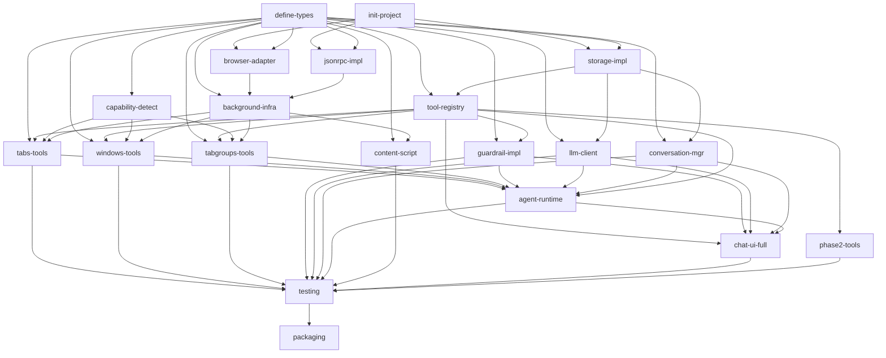

# DAG 任务图: Browser Agent

**日期:** 2026-06-20
**技术方案:** [Browser Agent.md](./Browser%20Agent.md)

---

## 依赖图



---

## 任务列表

### Batch 1（无依赖，可并行）

| Task ID | Slug | 标题 | 类型 | 涉及模块 | 预估工时 |
|---------|------|------|------|----------|----------|
| T1 | init-project | WXT 项目骨架初始化 + 构建配置 | infrastructure | 项目根 | 2h |
| T2 | define-types | 共享类型定义 | infrastructure | shared/types/ | 2h |

### Batch 2（依赖 T1，T2 建议先完成）

| Task ID | Slug | 标题 | 类型 | 依赖 | 涉及模块 | 预估工时 |
|---------|------|------|------|------|----------|----------|
| T3 | browser-adapter | Browser Adapter 接口 + Chrome/Firefox 实现 | backend | T1, T2 | adapters/ | 3h |
| T4 | jsonrpc-impl | JSON-RPC 通信层完整实现 | backend | T1, T2 | shared/jsonrpc/ | 3h |
| T5 | storage-impl | IndexedDB 封装 + ConfigStore | backend | T1, T2 | shared/db/, shared/storage/ | 3h |

### Batch 3（依赖 Batch 2）

| Task ID | Slug | 标题 | 类型 | 依赖 | 涉及模块 | 预估工时 |
|---------|------|------|------|------|----------|----------|
| T6 | tool-registry | Tool Registry 核心实现 | backend | T2, T5 | registry/ | 2h |
| T7 | capability-detect | Capability Detector | backend | T2, T3 | background/ | 2h |
| T8 | background-infra | Background JSON-RPC Router + API Proxy 骨架 + Event Listener | backend | T1, T2, T3, T4 | background/ | 3h |

### Batch 4（依赖 Batch 3，可并行）

| Task ID | Slug | 标题 | 类型 | 依赖 | 涉及模块 | 预估工时 |
|---------|------|------|------|------|----------|----------|
| T9 | tabs-tools | Tabs 工具集（8 个工具 + Preflight） | backend | T2, T6, T7, T8 | tools/tabs/ | 4h |
| T10 | windows-tools | Windows 工具集（4 个工具 + Preflight） | backend | T2, T6, T7, T8 | tools/windows/ | 3h |
| T11 | tabgroups-tools | TabGroups 工具集（2 个工具，Firefox 降级） | backend | T2, T6, T7, T8 | tools/tabGroups/ | 2h |
| T12 | guardrail-impl | Guardrail 风险控制实现 | backend | T2, T6 | guardrail/ | 3h |

### Batch 5（依赖 T5，可并行，与 Batch 3-4 可并行）

| Task ID | Slug | 标题 | 类型 | 依赖 | 涉及模块 | 预估工时 |
|---------|------|------|------|------|----------|----------|
| T13 | llm-client | LLM Provider Client（fetch + SSE 流式） | backend | T2, T5 | provider/ | 3h |
| T14 | conversation-mgr | Conversation Manager（IndexedDB CRUD + 摘要触发） | backend | T2, T5 | conversation/ | 3h |

### Batch 6（依赖 Batch 4 + Batch 5，与 Batch 7 可并行）

| Task ID | Slug | 标题 | 类型 | 依赖 | 涉及模块 | 预估工时 |
|---------|------|------|------|------|----------|----------|
| T15 | agent-runtime | Agent Runtime（Agent Loop + Context Builder + Summary Manager） | backend | T2, T6, T9, T10, T11, T12, T13, T14 | agent/ | 4h |
| T16 | content-script | Content Script 基础框架 + Page Tools | backend | T2, T4, T8 | content/, tools/page/ | 4h |

### Batch 7（依赖 Batch 6 + 部分 Batch 4/5）

| Task ID | Slug | 标题 | 类型 | 依赖 | 涉及模块 | 预估工时 |
|---------|------|------|------|------|----------|----------|
| T17 | chat-ui-full | Chat Page 完整 UI（消息列表 + 流式渲染 + 确认弹窗 + 设置页面 + 浏览器状态面板） | frontend | T6, T12, T13, T14, T15 | chat/ | 4h |

### Batch 8（依赖 T6，与 Batch 4-7 可并行）

| Task ID | Slug | 标题 | 类型 | 依赖 | 涉及模块 | 预估工时 |
|---------|------|------|------|------|----------|----------|
| T18 | phase2-tools | 第二阶段工具集（Bookmarks/History/Downloads/Cookies/Sessions/Clipboard/Notifications/Storage） | backend | T2, T6 | tools/bookmarks/, tools/history/, tools/downloads/, tools/cookies/, tools/sessions/, tools/misc/ | 4h |

### Batch 9（依赖所有实现任务）

| Task ID | Slug | 标题 | 类型 | 依赖 | 涉及模块 | 预估工时 |
|---------|------|------|------|------|----------|----------|
| T19 | testing | 单元测试 + E2E 测试 | testing | T9, T10, T11, T12, T13, T14, T15, T16, T17, T18 | __tests__/, e2e/ | 4h |

### Batch 10（依赖 T19）

| Task ID | Slug | 标题 | 类型 | 依赖 | 涉及模块 | 预估工时 |
|---------|------|------|------|------|----------|----------|
| T20 | packaging | Chrome + Firefox 打包签名 | infrastructure | T19 | dist/ | 2h |

---

## 任务详情

### T1: WXT 项目骨架初始化 + 构建配置
- **Slug:** `init-project`
- **类型:** infrastructure
- **依赖:** 无
- **涉及模块:** 项目根
- **描述:**
  初始化 WXT 项目，配置 TypeScript strict、TailwindCSS 4、ESLint + Prettier。创建 `wxt.config.ts` 支持 Chrome/Firefox 双构建。创建基础目录结构（`src/` 下各模块目录），配置 `package.json` 脚本（dev/build/zip/test）。
- **验收标准:**
  - [ ] `npm run dev` 正常启动开发环境（Chrome）
  - [ ] `npm run build` 产出 `dist/chrome-mv3/` 和 `dist/firefox-mv3/` 两个目录
  - [ ] `npm run zip` 产出两个 zip 文件
  - [ ] TypeScript strict 模式编译零错误
  - [ ] ESLint + Prettier 配置生效
  - [ ] TailwindCSS 4 正常编译
- **输出文件:**
  ```
  package.json
  wxt.config.ts
  tsconfig.json
  tailwind.config.ts (或 postcss.config.js)
  .eslintrc.json / eslint.config.js
  .prettierrc
  src/entrypoints/background.ts (空骨架)
  src/entrypoints/chat/index.html
  src/entrypoints/content.ts (空骨架)
  ```
- **关联用户故事:** US-0（基础设施）

---

### T2: 共享类型定义
- **Slug:** `define-types`
- **类型:** infrastructure
- **依赖:** 无
- **涉及模块:** `shared/types/`
- **描述:**
  定义全项目共享的 TypeScript 类型和接口。包括：浏览器数据类型（`Tab`, `Window`, `TabGroup`, `BrowserState`, `LowSensitivityContext`, `Capabilities`）、JSON-RPC 协议类型（`JsonRpcRequest`, `JsonRpcResponse`, `JsonRpcNotification`）、工具相关类型（`RiskLevel`, `ToolCategory`, `SensitivityLevel`, `ToolDefinition`, `ToolResult`, `PreflightResult`）、存储 Schema 类型。纯类型文件，零运行时依赖。
- **验收标准:**
  - [ ] `Tab`/`Window`/`TabGroup` 类型与 Chrome extensions API 类型兼容
  - [ ] `Capabilities` 覆盖所有 17 个能力域
  - [ ] `RiskLevel` 包含 `"low" | "medium" | "high" | "critical"`
  - [ ] `ToolCategory` 覆盖全部 16 个类别
  - [ ] `SensitivityLevel` 包含 `"low" | "sensitive" | "critical"`
  - [ ] JSON-RPC 类型符合 JSON-RPC 2.0 规范
  - [ ] 所有类型从 `src/shared/types/index.ts` 统一导出
- **输出文件:**
  ```
  src/shared/types/browser.ts
  src/shared/types/jsonrpc.ts
  src/shared/types/tool.ts
  src/shared/types/guardrail.ts
  src/shared/types/llm.ts
  src/shared/types/conversation.ts
  src/shared/types/storage.ts
  src/shared/types/index.ts
  ```
- **关联用户故事:** US-0（基础设施）

---

### T3: Browser Adapter 接口 + Chrome/Firefox 实现
- **Slug:** `browser-adapter`
- **类型:** backend
- **依赖:** T1, T2
- **涉及模块:** `adapters/`
- **描述:**
  定义 `IBrowserAdapter` 接口，封装 Chrome/Firefox extensions API 差异。实现 `ChromeAdapter` 和 `FirefoxAdapter`。运行时通过 `navigator.userAgent` 自动选择适配器。覆盖 tabs/windows/tabGroups 三个域的基础操作（后续 Phase 2 工具需要的域在对应任务中扩展）。
- **验收标准:**
  - [ ] `IBrowserAdapter` 接口定义完整，覆盖 tabs.query/get/create/update/remove/move/group/ungroup
  - [ ] `IBrowserAdapter` 覆盖 windows.getAll/get/create/update/remove/getCurrent/getLastFocused
  - [ ] `IBrowserAdapter` 覆盖 tabGroups.query/get/update/move（Firefox 返回 no-op）
  - [ ] `ChromeAdapter` 正确调用 `chrome.tabs/windows/tabGroups` API
  - [ ] `FirefoxAdapter` 正确调用 `browser.tabs/windows` API，tabGroups 操作返回 `{ success: false, error: "Not supported" }`
  - [ ] `getAdapter()` 工厂函数根据 userAgent 返回正确实例
  - [ ] 单元测试覆盖 Chrome/Firefox 两个适配器
- **输出文件:**
  ```
  src/adapters/types.ts
  src/adapters/chrome-adapter.ts
  src/adapters/firefox-adapter.ts
  src/adapters/index.ts
  src/adapters/__tests__/chrome-adapter.test.ts
  src/adapters/__tests__/firefox-adapter.test.ts
  ```
- **关联用户故事:** US-1（双浏览器支持）

---

### T4: JSON-RPC 通信层完整实现
- **Slug:** `jsonrpc-impl`
- **类型:** backend
- **依赖:** T1, T2
- **涉及模块:** `shared/jsonrpc/`
- **描述:**
  实现基于 `browser.runtime.connect()` 的 JSON-RPC 2.0 双向通信层。`JsonRpcClient` 支持 request（发请求等响应）、notify（发通知不等响应）、onRequest（注册方法处理器）、onNotification（注册通知处理器）。`JsonRpcRouter` 在 Background 端路由请求到对应 handler。支持超时、错误码标准化、连接断开重连。
- **验收标准:**
  - [ ] Chat Page 通过 `JsonRpcClient.request("ping")` 发送请求，Background 返回 `"pong"`
  - [ ] Background 通过 `JsonRpcClient.notify("browser.stateChanged", ...)` 推送事件到 Chat Page
  - [ ] Chat Page 通过 `onNotification("browser.stateChanged", handler)` 正确接收事件
  - [ ] 请求超时（默认 30s）正确抛出错误
  - [ ] 端口断开后自动重连
  - [ ] JSON-RPC 错误码符合规范（-32700 解析错误，-32601 方法不存在，-32603 内部错误）
  - [ ] 单元测试覆盖 request/notify/超时/错误码
- **输出文件:**
  ```
  src/shared/jsonrpc/types.ts
  src/shared/jsonrpc/client.ts
  src/shared/jsonrpc/router.ts
  src/shared/jsonrpc/errors.ts
  src/shared/jsonrpc/index.ts
  src/shared/jsonrpc/__tests__/client.test.ts
  src/shared/jsonrpc/__tests__/router.test.ts
  ```
- **关联用户故事:** US-3（内部通信）

---

### T5: IndexedDB 封装 + ConfigStore
- **Slug:** `storage-impl`
- **类型:** backend
- **依赖:** T1, T2
- **涉及模块:** `shared/db/`, `shared/storage/`
- **描述:**
  使用 `idb` 库封装 IndexedDB，实现 `conversations`、`messages`、`toolCallLogs`、`snapshots` 四张表的 CRUD 操作。实现 `ConfigStore` 封装 `chrome.storage.local`，支持 Provider 配置、Agent 设置、Expert Mode 设置的读写。数据库版本管理、索引创建、迁移策略。
- **验收标准:**
  - [ ] IndexedDB 数据库 `browser-agent-db` 版本 1 创建成功
  - [ ] `conversations` 表 CRUD 通过测试（创建/查询/列表/更新/删除）
  - [ ] `messages` 表按 `conversationId` 查询，按 `timestamp` 排序
  - [ ] `toolCallLogs` 表按 `conversationId` 查询
  - [ ] `snapshots` 表按 `capturedAt` 查询
  - [ ] `ConfigStore.get<ProviderConfig[]>('providers')` 正确读写
  - [ ] `ConfigStore` 支持 `onChanged` 监听
  - [ ] 单元测试覆盖所有 CRUD 操作
- **输出文件:**
  ```
  src/shared/db/schema.ts
  src/shared/db/database.ts
  src/shared/db/index.ts
  src/shared/storage/config-store.ts
  src/shared/storage/index.ts
  src/shared/db/__tests__/database.test.ts
  src/shared/storage/__tests__/config-store.test.ts
  ```
- **关联用户故事:** US-4（数据持久化）

---

### T6: Tool Registry 核心实现
- **Slug:** `tool-registry`
- **类型:** backend
- **依赖:** T2, T5
- **涉及模块:** `registry/`
- **描述:**
  实现 `IToolRegistry` 接口。支持工具的注册、查询、按类别过滤、导出 OpenAI Tool Schema。维护工具的唯一事实来源，所有工具的注册/卸载通过 Registry 完成。支持 Capability-based 条件注册（如 `tabGroups` 工具仅在 Chrome 注册）。Tool Schema 在注册时预计算并缓存。
- **验收标准:**
  - [ ] `register(tool)` 注册单个工具，重复注册同名工具抛出错误
  - [ ] `registerAll(tools)` 批量注册
  - [ ] `getAllTools()` 返回所有已注册工具
  - [ ] `getTool(name)` 按名称精确查找
  - [ ] `getToolsByCategory(category)` 按类别过滤
  - [ ] `toOpenAISchema()` 返回符合 OpenAI Function Calling 格式的数组
  - [ ] `unregisterCategory(category)` 卸载指定类别的所有工具
  - [ ] 单元测试覆盖率 >80%
- **输出文件:**
  ```
  src/registry/types.ts
  src/registry/tool-registry.ts
  src/registry/index.ts
  src/registry/__tests__/tool-registry.test.ts
  ```
- **关联用户故事:** US-5（工具系统）

---

### T7: Capability Detector
- **Slug:** `capability-detect`
- **类型:** backend
- **依赖:** T2, T3
- **涉及模块:** `background/`
- **描述:**
  实现 `CapabilityDetector`，检测当前浏览器可用的扩展 API 能力。通过尝试访问 `browser.tabs`、`browser.windows`、`browser.tabGroups` 等命名空间判断能力可用性。检测结果缓存，通过 JSON-RPC 暴露 `capability.detect` 方法供 Chat Page 查询。检测结果用于 Tool Registry 的条件注册（如 Firefox 不注册 tabGroups 工具）。
- **验收标准:**
  - [ ] Chrome 环境下检测到 `tabGroups: true`、`sidePanel: true`
  - [ ] Firefox 环境下检测到 `tabGroups: false`、`sidePanel: false`
  - [ ] 所有 17 个能力域均有检测结果
  - [ ] `capability.detect` JSON-RPC 方法正常返回
  - [ ] 检测结果缓存，多次调用不重复检测
  - [ ] 单元测试覆盖 Chrome/Firefox 两种场景
- **输出文件:**
  ```
  src/background/capability-detector.ts
  src/background/__tests__/capability-detector.test.ts
  ```
- **关联用户故事:** US-2（能力适配）

---

### T8: Background JSON-RPC Router + API Proxy 骨架 + Event Listener
- **Slug:** `background-infra`
- **类型:** backend
- **依赖:** T1, T2, T3, T4
- **涉及模块:** `background/`
- **描述:**
  实现 Background Service Worker 的 JSON-RPC Router，注册所有 API 方法的路由映射。实现 `TabsProxy`、`WindowsProxy`、`GroupsProxy` 三个代理类，封装 `IBrowserAdapter` 调用。实现 `BrowserEventHub`，监听 `tabs.onCreated/onUpdated/onRemoved/onMoved/onAttached/onDetached`、`windows.onCreated/onRemoved/onFocusChanged`、`tabGroups.onUpdated/onMoved` 事件，防抖 500ms 后全量查询状态并通过 JSON-RPC 通知推送到 Chat Page。实现 `ContentBridge`，转发 Chat Page 的请求到 Content Script。
- **验收标准:**
  - [ ] Background 启动后 JSON-RPC Router 正确注册所有路由
  - [ ] `tabs.query` 方法通过 RPC 可调用并返回正确结果
  - [ ] `windows.getAll` 方法通过 RPC 可调用并返回正确结果
  - [ ] 浏览器事件触发后 500ms 内推送 `browser.stateChanged` 通知
  - [ ] 防抖生效：连续多个事件合并为一次推送
  - [ ] `ContentBridge` 正确转发请求到指定 tabId 的 Content Script
  - [ ] Service Worker 休眠后通过 port 连接自动唤醒
- **输出文件:**
  ```
  src/background/index.ts (entrypoint)
  src/background/jsonrpc-router.ts
  src/background/tabs-proxy.ts
  src/background/windows-proxy.ts
  src/background/groups-proxy.ts
  src/background/browser-event-hub.ts
  src/background/content-bridge.ts
  ```
- **关联用户故事:** US-3（内部通信）, US-6（事件同步）

---

### T9: Tabs 工具集
- **Slug:** `tabs-tools`
- **类型:** backend
- **依赖:** T2, T6, T7, T8
- **涉及模块:** `tools/tabs/`
- **描述:**
  实现 8 个 Tabs 工具：`tabs_query`（查询）、`tabs_get`（获取单个）、`tabs_create`（创建）、`tabs_update`（更新）、`tabs_remove`（关闭）、`tabs_move`（移动）、`tabs_group`（分组）、`tabs_ungroup`（取消分组）。每个工具包含 ToolDefinition（name/description/schema/category/riskLevel/execute）。高风险工具（remove/group/ungroup）实现 `preflight` 函数返回影响对象列表。通过 JSON-RPC 调用 Background API Proxy 执行实际操作。
- **验收标准:**
  - [ ] `tabs_query` 低风险，直接执行，返回 Tab 列表
  - [ ] `tabs_create` 中风险，创建标签页成功
  - [ ] `tabs_remove` 高风险，preflight 返回被关闭标签页列表，用户确认后执行
  - [ ] `tabs_group`/`tabs_ungroup` 高风险，preflight 返回影响标签页列表
  - [ ] `tabs_move` 中风险，移动标签页到指定窗口/位置
  - [ ] 所有工具参数校验通过（必填参数检查、类型检查）
  - [ ] 所有工具注册到 ToolRegistry
  - [ ] 单元测试覆盖每个工具的执行和 preflight
- **输出文件:**
  ```
  src/tools/tabs/tabs-query.ts
  src/tools/tabs/tabs-get.ts
  src/tools/tabs/tabs-create.ts
  src/tools/tabs/tabs-update.ts
  src/tools/tabs/tabs-remove.ts
  src/tools/tabs/tabs-move.ts
  src/tools/tabs/tabs-group.ts
  src/tools/tabs/tabs-ungroup.ts
  src/tools/tabs/index.ts
  src/tools/tabs/__tests__/
  ```
- **关联用户故事:** US-7（标签页管理）

---

### T10: Windows 工具集
- **Slug:** `windows-tools`
- **类型:** backend
- **依赖:** T2, T6, T7, T8
- **涉及模块:** `tools/windows/`
- **描述:**
  实现 4 个 Windows 工具：`windows_getAll`、`windows_get`、`windows_create`、`windows_remove`。`windows_remove` 为高风险，preflight 返回窗口内所有标签页列表。
- **验收标准:**
  - [ ] `windows_getAll` 低风险，返回所有窗口信息
  - [ ] `windows_get` 低风险，返回单个窗口信息
  - [ ] `windows_create` 中风险，创建新窗口成功
  - [ ] `windows_remove` 高风险，preflight 列出窗口内所有标签页，确认后关闭
  - [ ] 所有工具注册到 ToolRegistry
  - [ ] 单元测试覆盖每个工具
- **输出文件:**
  ```
  src/tools/windows/windows-get-all.ts
  src/tools/windows/windows-get.ts
  src/tools/windows/windows-create.ts
  src/tools/windows/windows-remove.ts
  src/tools/windows/index.ts
  src/tools/windows/__tests__/
  ```
- **关联用户故事:** US-8（窗口管理）

---

### T11: TabGroups 工具集
- **Slug:** `tabgroups-tools`
- **类型:** backend
- **依赖:** T2, T6, T7, T8
- **涉及模块:** `tools/tabGroups/`
- **描述:**
  实现 2 个 TabGroups 工具：`tabGroups_query`、`tabGroups_update`。Firefox 环境通过 Capability Detector 检测到不支持后，工具不注册。
- **验收标准:**
  - [ ] `tabGroups_query` 低风险，返回分组列表
  - [ ] `tabGroups_update` 中风险，更新分组名称/颜色
  - [ ] Chrome 环境：工具正常注册并可用
  - [ ] Firefox 环境：工具不注册，`getToolsByCategory('tabGroups')` 返回空数组
  - [ ] 单元测试覆盖两种环境
- **输出文件:**
  ```
  src/tools/tabGroups/tabgroups-query.ts
  src/tools/tabGroups/tabgroups-update.ts
  src/tools/tabGroups/index.ts
  src/tools/tabGroups/__tests__/
  ```
- **关联用户故事:** US-9（分组管理）

---

### T12: Guardrail 风险控制实现
- **Slug:** `guardrail-impl`
- **类型:** backend
- **依赖:** T2, T6
- **涉及模块:** `guardrail/`
- **描述:**
  实现 `IGuardrail` 接口。`check(toolName, params, context)` 方法根据工具的风险等级、当前上下文（Provider 信任状态、Expert Mode 开关、会话授权状态）判断是否允许执行、是否需要 preflight、是否需要用户确认。敏感数据外发控制：`dataSensitivity` 为 `sensitive` 或 `critical` 的工具结果在发送给远程 LLM 前必须过滤或要求会话级授权。
- **验收标准:**
  - [ ] `riskLevel = "low"` 工具直接放行
  - [ ] `riskLevel = "medium"` 工具放行但记录日志
  - [ ] `riskLevel = "high"` 工具必须 preflight + 用户确认
  - [ ] `riskLevel = "critical"` 工具仅在 Expert Mode 开启时可用，且必须确认
  - [ ] `isLocalTrusted = true` 时 high/critical 工具可跳过确认（但 preflight 仍执行）
  - [ ] `dataSensitivity = "critical"` 的工具结果禁止发送给远程 Provider
  - [ ] `sessionGrants.sensitiveDataAllowed` 可临时授权发送敏感数据
  - [ ] `expertSwitches` 控制 Expert Mode 子开关
  - [ ] 单元测试覆盖所有风险等级组合
- **输出文件:**
  ```
  src/guardrail/types.ts
  src/guardrail/guardrail.ts
  src/guardrail/index.ts
  src/guardrail/__tests__/guardrail.test.ts
  ```
- **关联用户故事:** US-10（安全控制）

---

### T13: LLM Provider Client
- **Slug:** `llm-client`
- **类型:** backend
- **依赖:** T2, T5
- **涉及模块:** `provider/`
- **描述:**
  实现 `ILlmClient` 接口。封装 `fetch` 调用 OpenAI-compatible API（`/v1/chat/completions`）。支持非流式（`chat`）和流式（`chatStream` via SSE ReadableStream）。支持 `AbortController` 中止。实现 `checkHealth` 方法验证端点可用性。Provider 配置从 ConfigStore 读取，支持多 Provider Profile。
- **验收标准:**
  - [ ] `chat(request)` 非流式调用 OpenAI API，返回 `ChatCompletionResponse`
  - [ ] `chatStream(request, onChunk)` 流式调用，逐 chunk 回调
  - [ ] 支持 OpenAI / Ollama / llama-server / 任意兼容端点
  - [ ] `checkHealth(config)` 验证端点可连接（返回 true/false）
  - [ ] `AbortController` 信号正确中止请求
  - [ ] 请求超时 120s（非流式）
  - [ ] `extraHeaders` 正确附加到请求
  - [ ] 单元测试 mock fetch，覆盖成功/失败/超时/中止场景
- **输出文件:**
  ```
  src/provider/types.ts
  src/provider/llm-client.ts
  src/provider/index.ts
  src/provider/__tests__/llm-client.test.ts
  ```
- **关联用户故事:** US-11（LLM 集成）

---

### T14: Conversation Manager
- **Slug:** `conversation-mgr`
- **类型:** backend
- **依赖:** T2, T5
- **涉及模块:** `conversation/`
- **描述:**
  实现 `IConversationManager` 接口。基于 IndexedDB 实现多会话的 CRUD。消息按 `conversationId` + `timestamp` 索引查询。`getRecentMessages(conversationId, count)` 返回最近 N 条消息用于 LLM 上下文。`needsSummary(conversationId)` 检查是否超过阈值（消息数 >30 或估计 token >12000）。`generateSummary(conversationId, llmClient)` 调用 LLM 生成摘要，存储到 conversation.summary。
- **验收标准:**
  - [ ] `create()` 创建新会话，返回 Conversation 对象（含 UUID、时间戳）
  - [ ] `get(id)` 获取会话，包含所有消息
  - [ ] `list()` 按 `updatedAt` 降序返回所有会话
  - [ ] `update(id, patch)` 部分更新会话属性（title、summary 等）
  - [ ] `delete(id)` 删除会话及其所有消息
  - [ ] `addMessage(conversationId, message)` 添加消息并更新 `updatedAt`
  - [ ] `getRecentMessages(conversationId, 20)` 返回最近 20 条消息
  - [ ] `needsSummary(conversationId)` 超阈值返回 true
  - [ ] `generateSummary(conversationId, llmClient)` 生成并存储摘要
  - [ ] 单元测试覆盖所有 CRUD 操作
- **输出文件:**
  ```
  src/conversation/types.ts
  src/conversation/conversation-manager.ts
  src/conversation/index.ts
  src/conversation/__tests__/conversation-manager.test.ts
  ```
- **关联用户故事:** US-12（多会话管理）

---

### T15: Agent Runtime
- **Slug:** `agent-runtime`
- **类型:** backend
- **依赖:** T2, T6, T9, T10, T11, T12, T13, T14
- **涉及模块:** `agent/`
- **描述:**
  实现 `IAgentRuntime` 接口。`AgentLoop.run()` 执行完整的 Agent 循环：
  1. `ContextBuilder` 构造上下文（system prompt + tools schema + 最近消息 + 摘要 + 低敏浏览器上下文）
  2. 调用 `LlmClient.chat()` 获取 LLM 响应
  3. 解析 `tool_calls`，校验 tool name 存在于 Registry
  4. 通过 `Guardrail.check()` 判断是否可执行
  5. 如需要 preflight，执行 preflight 并触发用户确认
  6. 通过 `ToolRegistry.execute()` 执行工具
  7. 结果注入上下文，继续循环（最多 15 轮）
  8. 最终生成文本回复

  `SummaryManager` 在每轮后检查是否需要触发摘要生成。`ContextBuilder` 负责组装完整的 messages 数组（含 system prompt、history、summary、browser context）。
- **验收标准:**
  - [ ] 单轮工具调用正常：用户消息 → tool_call → 执行 → 最终回复
  - [ ] 多轮工具调用正常：连续多个 tool_call 依次执行
  - [ ] LLM 返回无效 tool_call（名称不存在）时捕获错误，反馈给 LLM 重试（最多 3 次）
  - [ ] LLM 返回无效参数时捕获错误，反馈给 LLM 重试
  - [ ] `maxToolRounds` 达到上限后强制终止，生成 "操作过于复杂" 的回复
  - [ ] `AbortController` 中止时 Agent Loop 立即停止
  - [ ] `ContextBuilder` 正确注入 system prompt + tools + history + summary + browser context
  - [ ] `SummaryManager` 在超过阈值后自动触发摘要生成
  - [ ] 单元测试 mock LLM 响应，覆盖正常/异常/超限/中止场景
- **输出文件:**
  ```
  src/agent/types.ts
  src/agent/agent-loop.ts
  src/agent/context-builder.ts
  src/agent/summary-manager.ts
  src/agent/system-prompt.ts
  src/agent/index.ts
  src/agent/__tests__/agent-loop.test.ts
  src/agent/__tests__/context-builder.test.ts
  ```
- **关联用户故事:** US-13（Agent 核心循环）

---

### T16: Content Script 基础框架 + Page Tools
- **Slug:** `content-script`
- **类型:** backend
- **依赖:** T2, T4, T8
- **涉及模块:** `content/`, `tools/page/`
- **描述:**
  实现 Content Script 的 JSON-RPC Handler，接收 Background 转发的请求。集成 `@mozilla/readability` 实现正文提取（`page.getContent`）。实现选中文本读取（`page.getSelection`）。实现页面元数据提取（`page.getMetadata`）。将 3 个 Page 工具注册到 Tool Registry。Content Script 通过 `manifest.content_scripts` 声明式注入所有页面。
- **验收标准:**
  - [ ] Content Script 在所有页面自动注入（通过 manifest 声明）
  - [ ] `page.getContent` 返回 `{ title, textContent, excerpt, byline, siteName }`
  - [ ] `page.getSelection` 返回选中文本（纯文本 + HTML）
  - [ ] `page.getMetadata` 返回 `{ title, url, description, ogImage }`
  - [ ] Content Script 通过 JSON-RPC 与 Background 正常通信
  - [ ] Readability 提取超时 30s 后返回部分结果
  - [ ] 3 个工具注册到 ToolRegistry，category 为 `"page"`
  - [ ] 单元测试 mock DOM，覆盖正文提取和选中文本
- **输出文件:**
  ```
  src/content/index.ts (entrypoint)
  src/content/jsonrpc-handler.ts
  src/content/readability-extractor.ts
  src/content/selection-reader.ts
  src/content/metadata-reader.ts
  src/tools/page/page-get-content.ts
  src/tools/page/page-get-selection.ts
  src/tools/page/page-get-metadata.ts
  src/tools/page/index.ts
  ```
- **关联用户故事:** US-14（页面内容）

---

### T17: Chat Page 完整 UI
- **Slug:** `chat-ui-full`
- **类型:** frontend
- **依赖:** T6, T12, T13, T14, T15
- **涉及模块:** `chat/`
- **描述:**
  实现 Chat Page 的完整 React UI，包含以下子组件：
  - **ChatView**: 消息列表渲染（用户消息、助手消息、工具调用卡片），流式渲染助手消息（逐 token 显示），虚拟列表（消息 >100 时启用 `@tanstack/react-virtual`）
  - **MessageInput**: 文本输入框 + 发送按钮，支持 Enter 发送、Shift+Enter 换行，发送中显示 loading 状态，Abort 按钮
  - **ConfirmDialog**: 高风险操作确认弹窗，展示 Preflight 结果（影响对象列表 + 警告），确认/取消按钮
  - **SettingsPanel**: 设置页面，Provider 配置（增删改查、标记 local-trusted）、Agent 设置（maxToolRounds/systemPrompt/maxContextMessages）、Expert Mode 开关及子开关
  - **BrowserStatePanel**: 侧边栏，实时显示当前 tabs/windows/tabGroups 状态，支持点击切换活跃标签页
  - **ConversationSidebar**: 会话列表，新建/切换/删除/重命名会话
- **验收标准:**
  - [ ] 用户输入消息 → Agent 运行 → 流式显示 LLM 输出
  - [ ] 工具调用显示为独立卡片（工具名 + 参数摘要 + 结果摘要）
  - [ ] 高风险工具触发确认弹窗，用户确认后继续执行
  - [ ] 发送中显示 Abort 按钮，点击后中止 Agent 运行
  - [ ] 设置页面数据持久化到 ConfigStore
  - [ ] 浏览器状态面板实时更新（收到 `browser.stateChanged` 通知后刷新）
  - [ ] 会话列表支持新建/切换/删除/重命名
  - [ ] 消息 >100 时启用虚拟滚动，滚动流畅不卡顿
  - [ ] LLM 输出正确转义 HTML（XSS 防护）
  - [ ] 响应式布局，支持窄屏（侧边栏折叠）
- **输出文件:**
  ```
  src/chat/index.html
  src/chat/main.tsx
  src/chat/App.tsx
  src/chat/components/ChatView.tsx
  src/chat/components/MessageBubble.tsx
  src/chat/components/ToolCallCard.tsx
  src/chat/components/MessageInput.tsx
  src/chat/components/ConfirmDialog.tsx
  src/chat/components/SettingsPanel.tsx
  src/chat/components/BrowserStatePanel.tsx
  src/chat/components/ConversationSidebar.tsx
  src/chat/hooks/useAgent.ts
  src/chat/hooks/useBrowserState.ts
  src/chat/hooks/useConversations.ts
  ```
- **关联用户故事:** US-15（聊天界面）, US-16（设置）, US-17（确认流程）, US-18（状态面板）

---

### T18: 第二阶段工具集
- **Slug:** `phase2-tools`
- **类型:** backend
- **依赖:** T2, T6
- **涉及模块:** `tools/bookmarks/`, `tools/history/`, `tools/downloads/`, `tools/cookies/`, `tools/sessions/`, `tools/misc/`
- **描述:**
  实现第二阶段工具集，涵盖 6 个工具域：
  - **Bookmarks**: `bookmarks_search`（搜索）、`bookmarks_create`（创建）、`bookmarks_update`（更新）、`bookmarks_delete`（删除）
  - **History**: `history_search`（搜索）、`history_delete`（删除）
  - **Downloads**: `downloads_search`（搜索）、`downloads_download`（下载）、`downloads_erase`（清除）
  - **Cookies**: `cookies_get`（获取）、`cookies_set`（设置）、`cookies_delete`（删除）
  - **Sessions**: `session_save`（保存快照）、`session_restore`（恢复快照）
  - **Misc**: `clipboard_read`、`clipboard_write`、`notifications_create`、`storage_get`、`storage_set`
  所有高风险操作（删除、清除、写入）实现 preflight。
- **验收标准:**
  - [ ] 每个工具域的工具注册到 ToolRegistry
  - [ ] 高风险操作（delete/erase/write）preflight 返回影响对象
  - [ ] Bookmarks 工具 CRUD 正常
  - [ ] History 工具搜索/删除正常
  - [ ] Downloads 工具搜索/下载/清除正常
  - [ ] Cookies 工具获取/设置/删除正常，sensitivity 标记为 critical
  - [ ] Session 工具保存/恢复正常
  - [ ] Clipboard/Notifications/Storage 工具正常
  - [ ] 单元测试覆盖每个工具域
- **输出文件:**
  ```
  src/tools/bookmarks/bookmarks-search.ts
  src/tools/bookmarks/bookmarks-create.ts
  src/tools/bookmarks/bookmarks-update.ts
  src/tools/bookmarks/bookmarks-delete.ts
  src/tools/bookmarks/index.ts
  src/tools/history/history-search.ts
  src/tools/history/history-delete.ts
  src/tools/history/index.ts
  src/tools/downloads/downloads-search.ts
  src/tools/downloads/downloads-download.ts
  src/tools/downloads/downloads-erase.ts
  src/tools/downloads/index.ts
  src/tools/cookies/cookies-get.ts
  src/tools/cookies/cookies-set.ts
  src/tools/cookies/cookies-delete.ts
  src/tools/cookies/index.ts
  src/tools/sessions/session-save.ts
  src/tools/sessions/session-restore.ts
  src/tools/sessions/index.ts
  src/tools/misc/clipboard-read.ts
  src/tools/misc/clipboard-write.ts
  src/tools/misc/notifications-create.ts
  src/tools/misc/storage-get.ts
  src/tools/misc/storage-set.ts
  src/tools/misc/index.ts
  ```
- **关联用户故事:** US-19~US-24（第二阶段能力）

---

### T19: 单元测试 + E2E 测试
- **Slug:** `testing`
- **类型:** testing
- **依赖:** T9, T10, T11, T12, T13, T14, T15, T16, T17, T18
- **涉及模块:** `__tests__/`, `e2e/`
- **描述:**
  编写单元测试覆盖核心模块（Tool Registry / Guardrail / Agent Loop / JSON-RPC / LLM Client / Conversation Manager），目标覆盖率 >70%。编写 Playwright E2E 测试覆盖核心用户流程：打开 Chat Page → 输入消息 → Agent 回复 → 执行低风险工具 → 确认高风险工具 → 多会话切换。
- **验收标准:**
  - [ ] 单元测试覆盖率 >70%（`npx vitest --coverage`）
  - [ ] E2E: 发送 "列出所有标签页" → Agent 调用 `tabs_query` → 显示标签页列表
  - [ ] E2E: 发送 "关闭所有 YouTube 标签页" → 弹出确认 → 确认后执行
  - [ ] E2E: 设置页面增删 Provider Profile 正常
  - [ ] E2E: 新建/切换/删除会话正常
  - [ ] E2E: 刷新页面后消息不丢失
- **输出文件:**
  ```
  src/registry/__tests__/tool-registry.test.ts
  src/guardrail/__tests__/guardrail.test.ts
  src/agent/__tests__/agent-loop.test.ts
  src/agent/__tests__/context-builder.test.ts
  src/shared/jsonrpc/__tests__/client.test.ts
  src/shared/jsonrpc/__tests__/router.test.ts
  src/provider/__tests__/llm-client.test.ts
  src/conversation/__tests__/conversation-manager.test.ts
  src/adapters/__tests__/chrome-adapter.test.ts
  src/adapters/__tests__/firefox-adapter.test.ts
  src/shared/db/__tests__/database.test.ts
  src/shared/storage/__tests__/config-store.test.ts
  e2e/chat-flow.spec.ts
  e2e/settings.spec.ts
  e2e/conversations.spec.ts
  playwright.config.ts
  vitest.config.ts
  ```
- **关联用户故事:** US-25（质量保证）

---

### T20: Chrome + Firefox 打包签名
- **Slug:** `packaging`
- **类型:** infrastructure
- **依赖:** T19
- **涉及模块:** `dist/`
- **描述:**
  配置 WXT 生产构建，产出 Chrome 和 Firefox 两个 zip 包。编写 CI 构建脚本（GitHub Actions 或手动脚本）。Chrome 扩展打包 + 签名（通过 Chrome Web Store API）。Firefox 扩展打包 + 签名（通过 `web-ext sign`）。验证两个产物均可正确加载。
- **验收标准:**
  - [ ] `npm run build:chrome` 产出 `dist/chrome-mv3/` 目录
  - [ ] `npm run build:firefox` 产出 `dist/firefox-mv3/` 目录
  - [ ] `npm run zip` 产出两个 zip 文件
  - [ ] Chrome zip 可在 `chrome://extensions` 加载已解压扩展，功能正常
  - [ ] Firefox zip 可在 `about:debugging` 加载临时扩展，功能正常
  - [ ] Manifest 权限差异正确（Firefox 不含 `tabGroups`/`sidePanel`）
  - [ ] 单个 zip 体积 < 2MB（压缩后）
- **输出文件:**
  ```
  dist/chrome-mv3/ (目录)
  dist/firefox-mv3/ (目录)
  scripts/build.sh (或 .github/workflows/build.yml)
  ```
- **关联用户故事:** US-26（发布）

---

## 循环依赖检查

✅ 未检测到循环依赖

所有依赖关系均为有向无环图（DAG），从基础设施 → 核心运行时 → 工具系统 → Agent 循环 → UI → 测试 → 打包，单向推进。

---

## 并行开发建议

| 并行组 | 任务 | 说明 |
|--------|------|------|
| 组 A | T1, T2 | 基础设施初始化，2 人可并行（分别负责项目骨架和类型定义） |
| 组 B | T3, T4, T5 | 共享基础设施，3 人可并行（Adapter / JSON-RPC / Storage） |
| 组 C | T6, T7, T8 | 核心运行时，3 人可并行（Registry / Capability / Background） |
| 组 D | T9, T10, T11, T12 | 工具 + 安全，4 人可并行（Tabs / Windows / TabGroups / Guardrail） |
| 组 E | T13, T14, T16 | LLM / 会话 / Content Script，3 人可并行 |
| 组 F | T15, T17, T18 | Agent + UI + Phase2，3 人可并行（Agent 依赖组 D+E，UI 依赖 Agent，Phase2 仅依赖 T6） |
| 组 G | T19, T20 | 测试 + 打包，2 人可并行（打包依赖测试完成） |

**关键路径:** T1 → T3/T4/T5 → T6/T7/T8 → T9/T10/T11 → T12 → T13/T14 → T15 → T17 → T19 → T20

**预估总工期（单人）：** ~55 小时（约 11 个工作日）

**预估总工期（3 人并行）：** ~25 小时（约 5 个工作日）

---

## 风险点

| 风险 | 影响任务 | 缓解 |
|------|---------|------|
| WXT Firefox MV3 兼容性 | T1, T20 | 先用 Chrome 验证，Firefox 必要时降级 MV2 |
| `@mozilla/readability` Content Script 兼容性 | T16 | 设置 30s 超时，失败返回错误信息 |
| LLM 幻觉 tool_call 频率 | T15 | Agent Loop 校验 + 错误反馈重试（最多 3 次） |
| IndexedDB 浏览器兼容性 | T5, T14 | `idb` 库已处理，Chrome/Firefox 均支持 |
| Service Worker 休眠 | T8 | `browser.runtime.connect()` + alarms API 保活 |
