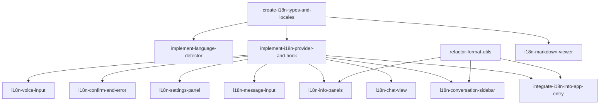

# DAG 任务图: i18n 国际化支持

**日期:** 2026-06-29
**来源:** 技术方案 `docs/design/i18n-国际化支持.md`

## 依赖图



## 任务列表

### Batch 1（无依赖，可并行）

| Task ID | Slug | 标题 | 类型 | 涉及模块 | 预估工时 |
|---------|------|------|------|----------|----------|
| T1 | create-i18n-types-and-locales | 创建类型定义 + 中英文语言包 | frontend | i18n/types.ts, locales/ | 2.5h |
| T4 | refactor-format-utils | 改造 utils.ts 格式化函数增加 locale 参数 | frontend | sidepanel/utils.ts | 0.5h |

### Batch 2（依赖 T1）

| Task ID | Slug | 标题 | 类型 | 依赖 | 涉及模块 | 预估工时 |
|---------|------|------|------|------|----------|----------|
| T2 | implement-language-detector | 实现首次语言检测逻辑 | frontend | T1 | i18n/language-detector.ts | 0.5h |
| T3 | implement-i18n-provider-and-hook | 实现 I18nProvider + useI18n hook | frontend | T1 | i18n/I18nProvider.tsx, i18n/useI18n.ts | 1.5h |
| T13 | i18n-markdown-viewer | markdown-viewer 独立入口国际化改造 | frontend | T1 | markdown-viewer/index.ts | 0.5h |

### Batch 3（依赖 T3 + T4，组件改造可并行）

| Task ID | Slug | 标题 | 类型 | 依赖 | 涉及模块 | 预估工时 |
|---------|------|------|------|------|----------|----------|
| T5 | integrate-i18n-into-app-entry | App 包裹 I18nProvider + header 国际化 | frontend | T3, T4 | App.tsx, main.tsx | 1h |
| T6 | i18n-conversation-sidebar | ConversationSidebar 国际化 | frontend | T3, T4 | components/ConversationSidebar.tsx | 1h |
| T7 | i18n-chat-view | ChatView / MessageBubble / ToolCallCard 国际化 | frontend | T3 | components/ChatView.tsx, MessageBubble.tsx, ToolCallCard.tsx | 1h |
| T8 | i18n-message-input | MessageInput 国际化 | frontend | T3 | components/MessageInput.tsx | 0.5h |
| T9 | i18n-settings-panel | SettingsPanel 国际化 + 语言选择器 | frontend | T3 | components/SettingsPanel.tsx | 1.5h |
| T10 | i18n-confirm-and-error | ConfirmDialog + ErrorBoundary 国际化 | frontend | T3 | components/ConfirmDialog.tsx, ErrorBoundary.tsx | 0.5h |
| T11 | i18n-info-panels | BrowserStatePanel / TokenPanel / SkillPanel 国际化 | frontend | T3, T4 | components/BrowserStatePanel.tsx, TokenPanel.tsx, SkillPanel.tsx | 1h |
| T12 | i18n-voice-input | useVoiceInput hook 错误消息国际化 | frontend | T3 | hooks/useVoiceInput.ts | 0.5h |

## 任务详情

### T1: 创建类型定义 + 中英文语言包
- **Slug:** `create-i18n-types-and-locales`
- **类型:** frontend
- **依赖:** 无
- **涉及模块:** `src/entrypoints/sidepanel/i18n/types.ts`, `src/entrypoints/sidepanel/locales/`
- **描述:**
  1. 创建 `i18n/types.ts`：定义 `Locale`（`'zh-CN' | 'en'`）、`MessageSchema`（含 `common`/`app`/`sidebar`/`chat`/`settings`/`dialog`/`browser`/`token`/`error`/`markdown`/`voice` 命名空间）、`I18nContextValue`（`locale`/`t`/`setLanguage`）
  2. 创建 `locales/zh-CN.json`：提取所有组件中现有的硬编码中文文本，按 `MessageSchema` 结构填充，约 80+ 条
  3. 创建 `locales/en.json`：英译所有中文文本，结构与 `zh-CN.json` 完全一致
  4. Key 命名规则：点分隔路径，如 `sidebar.status.running`；模板变量使用 `{{varName}}` 语法
  5. 音频格式映射 (`provider.audioFormats.*`) 的值保持技术缩写不变，仅翻译 label 侧
- **验收标准:**
  - [ ] `i18n/types.ts` 通过 TypeScript 编译，无类型错误
  - [ ] `zh-CN.json` 覆盖所有组件的现有硬编码文本（逐一核对 13 个组件）
  - [ ] `en.json` 所有 key 与 `zh-CN.json` 完全对应，无遗漏
  - [ ] `en.json` 英文翻译语义正确，术语一致
  - [ ] 两个 JSON 文件不包含任何硬编码中文（除音频格式缩写外）
  - [ ] 模板变量 key 在两个语言包中一致
- **输出文件:**
  - `src/entrypoints/sidepanel/i18n/types.ts`（新建）
  - `src/entrypoints/sidepanel/locales/zh-CN.json`（新建）
  - `src/entrypoints/sidepanel/locales/en.json`（新建）
- **关联用户故事:** US-1 (基础 i18n 基础设施)

---

### T2: 实现首次语言检测逻辑
- **Slug:** `implement-language-detector`
- **类型:** frontend
- **依赖:** T1
- **涉及模块:** `src/entrypoints/sidepanel/i18n/language-detector.ts`
- **描述:**
  实现 `detectAndSetLanguage()` 函数：
  1. 先检查 `ConfigStore.get('preferences').language` 是否已有值，若有则直接返回（用户已手动选择）
  2. 若无，读取 `navigator.language`（如 `'en-US'`、`'zh-CN'`、`'zh'`）
  3. 匹配逻辑：`'zh'` 或 `'zh-CN'` 开头 → `'zh-CN'`；`'en'` 开头 → `'en'`；其他 → 默认 `'zh-CN'`
  4. 将检测结果写入 `ConfigStore.set('preferences', { ..., language })`
  5. 在 `main.tsx` 中渲染前同步调用此函数（避免首次渲染闪烁）
- **验收标准:**
  - [ ] 首次启动（无偏好记录）时自动检测浏览器语言
  - [ ] 浏览器语言为 `zh-CN` / `zh` 时设置为 `'zh-CN'`
  - [ ] 浏览器语言为 `en` / `en-US` 时设置为 `'en'`
  - [ ] 其他语言默认回退到 `'zh-CN'`
  - [ ] 已有偏好时跳过检测，不覆盖用户选择
  - [ ] 检测结果正确持久化到 `ConfigStore`
  - [ ] 在 `main.tsx` 渲染前同步执行，无闪烁
- **输出文件:**
  - `src/entrypoints/sidepanel/i18n/language-detector.ts`（新建）
- **关联用户故事:** US-1 (首次语言检测)

---

### T3: 实现 I18nProvider + useI18n hook
- **Slug:** `implement-i18n-provider-and-hook`
- **类型:** frontend
- **依赖:** T1
- **涉及模块:** `src/entrypoints/sidepanel/i18n/I18nProvider.tsx`, `src/entrypoints/sidepanel/i18n/useI18n.ts`
- **描述:**
  1. **I18nProvider** (React 组件):
     - 从 `ConfigStore.get('preferences').language` 读取初始语言
     - 静态 import `zh-CN.json` 和 `en.json`，根据 `language` 选择当前 `messages`
     - 创建 `I18nContext`，提供 `{ locale, t, setLanguage }` 给子树
     - `t(key, vars?)`：
       - 按 `.` 分割 key，逐级从 messages 对象取值
       - key 不存在时回退：`console.warn` 并返回 key 本身
       - 使用 `resolveTemplate(template, vars)` 替换 `{{varName}}` 占位符
     - `setLanguage(lang)`：
       - 更新 `ConfigStore.set('preferences', { language: lang })`
       - 切换 `messages` 引用，触发子树重渲染
     - 使用 `useEffect` 监听 `ConfigStore.onChange`：
       - 当 `preferences.language` 变更时（跨标签页同步），自动更新 `language` state
  2. **useI18n** hook:
     - 通过 `useContext(I18nContext)` 获取 `I18nContextValue`
     - 若 Provider 未挂载，抛出明确错误
  3. **resolveTemplate** 工具函数（内联于 Provider 或独立导出）:
     - 正则 `/\{\{(\w+)\}\}/g` 匹配模板变量
     - 替换为 `String(vars[key])`，未提供的 key 保留原始占位符并 `console.warn`
- **验收标准:**
  - [ ] `I18nProvider` 正确包裹子组件并提供 context
  - [ ] `t()` 支持点分隔路径解析（如 `t('sidebar.status.running')`）
  - [ ] `t()` 支持模板变量替换（如 `t('token.total', { total: 100 })`）
  - [ ] `t()` key 不存在时打印 warning 并返回 key 字符串（不崩溃）
  - [ ] `t()` 未替换的模板变量打印 warning
  - [ ] `setLanguage('en')` 更新 `ConfigStore` 并触发子树重渲染
  - [ ] `ConfigStore.onChange` 触发语言自动更新（跨标签页同步）
  - [ ] `useI18n()` 在 Provider 外调用时抛出明确错误
  - [ ] 两个语言包 JSON 通过静态 import 加载，无运行时 fetch 请求
- **输出文件:**
  - `src/entrypoints/sidepanel/i18n/I18nProvider.tsx`（新建）
  - `src/entrypoints/sidepanel/i18n/useI18n.ts`（新建）
- **关联用户故事:** US-1 (i18n 核心机制), US-2 (语言切换)

---

### T4: 改造 utils.ts 格式化函数增加 locale 参数
- **Slug:** `refactor-format-utils`
- **类型:** frontend
- **依赖:** 无
- **涉及模块:** `src/entrypoints/sidepanel/utils.ts`
- **描述:**
  改造三个格式化函数，增加 `locale` 参数，保持向后兼容：
  1. `formatTime(ts: number, locale?: string)` — 使用 `new Date(ts).toLocaleTimeString(locale, { hour: '2-digit', minute: '2-digit' })`，默认 `'zh-CN'`
  2. `formatDateTime(ts: number, locale?: string)` — 使用 `new Date(ts).toLocaleString(locale, { year: 'numeric', month: '2-digit', day: '2-digit', hour: '2-digit', minute: '2-digit' })`，默认 `'zh-CN'`
  3. `formatNum(n: number, locale?: string)` — 使用 `n.toLocaleString(locale)`，默认 `'zh-CN'`
  4. 保持所有现有调用无需改动（locale 可选参数，不传时行为与改造前一致）
- **验收标准:**
  - [ ] `formatTime` 支持 locale 参数，英文环境下显示 AM/PM 格式
  - [ ] `formatDateTime` 支持 locale 参数，英文环境下日期格式为 MM/DD/YYYY
  - [ ] `formatNum` 支持 locale 参数，英文环境下千位分隔为 `,`
  - [ ] 不传 locale 时行为与改造前完全一致（默认 `'zh-CN'`）
  - [ ] 所有现有调用处无需修改即可通过编译
- **输出文件:**
  - `src/entrypoints/sidepanel/utils.ts`（修改）
- **关联用户故事:** US-3 (日期/时间/数字格式化)

---

### T5: App 包裹 I18nProvider + header 国际化
- **Slug:** `integrate-i18n-into-app-entry`
- **类型:** frontend
- **依赖:** T3, T4
- **涉及模块:** `src/entrypoints/sidepanel/main.tsx`, `src/entrypoints/sidepanel/App.tsx`
- **描述:**
  1. **main.tsx**: 在 `ReactDOM.createRoot` 渲染前调用 `detectAndSetLanguage()`（来自 T2），确保语言已就绪
  2. **App.tsx**:
     - 用 `<I18nProvider>` 包裹整个 App 组件树（最外层）
     - 在 App 组件内调用 `useI18n()`，将 header 中的硬编码文本替换为 `t()` 调用：
       - 页面标题（`document.title` 或 header 组件中的 title）
       - 加载中消息 (`app.loadingMessages`)
       - 加载失败消息 (`app.loadFailed`)
- **验收标准:**
  - [ ] `main.tsx` 在渲染前同步执行语言检测
  - [ ] `App.tsx` 根节点被 `I18nProvider` 包裹
  - [ ] App header 标题跟随语言切换
  - [ ] 加载中/失败消息可切换中英文
  - [ ] 语言切换时 App 组件正确重渲染
- **输出文件:**
  - `src/entrypoints/sidepanel/main.tsx`（修改）
  - `src/entrypoints/sidepanel/App.tsx`（修改）
- **关联用户故事:** US-1 (Provider 接入), US-4 (App 级文本)

---

### T6: ConversationSidebar 国际化
- **Slug:** `i18n-conversation-sidebar`
- **类型:** frontend
- **依赖:** T3, T4
- **涉及模块:** `src/entrypoints/sidepanel/components/ConversationSidebar.tsx`
- **描述:**
  在 `ConversationSidebar` 组件中：
  1. 引入 `useI18n`，获取 `t` 和 `locale`
  2. 替换所有硬编码中文文本为 `t()` 调用：
     - 标题 `sidebar.title`
     - 新对话按钮 `sidebar.newChat`
     - 折叠/展开 `sidebar.collapse` / `sidebar.expand`
     - 设置按钮 `sidebar.settings`
     - 空状态提示 `sidebar.noConversations`
     - 重命名/删除 `sidebar.rename` / `sidebar.delete`
     - Token 统计标签：`sidebar.input` / `sidebar.output` / `sidebar.total`
     - 对话状态：`sidebar.status.idle` / `sidebar.status.running` / `sidebar.status.streaming` / `sidebar.status.waitingConfirmation`
  3. `formatNum` 调用传入 `locale`（token 数量格式化）
  4. `formatDateTime` 调用传入 `locale`（对话时间格式化）
- **验收标准:**
  - [ ] 侧栏标题可切换中/英文
  - [ ] 新对话、折叠、设置按钮文本可切换
  - [ ] 对话状态标签（空闲/运行中/流式输出/等待确认）可切换
  - [ ] Token 统计数字随 locale 格式化（千位分隔符）
  - [ ] 对话时间格式随 locale 变化
  - [ ] 空状态文本可切换
- **输出文件:**
  - `src/entrypoints/sidepanel/components/ConversationSidebar.tsx`（修改）
- **关联用户故事:** US-4 (Sidebar 文本)

---

### T7: ChatView / MessageBubble / ToolCallCard 国际化
- **Slug:** `i18n-chat-view`
- **类型:** frontend
- **依赖:** T3
- **涉及模块:** `src/entrypoints/sidepanel/components/ChatView.tsx`, `MessageBubble.tsx`, `ToolCallCard.tsx`
- **描述:**
  在三个对话相关组件中替换硬编码文本：
  1. **ChatView.tsx**: 加载提示等
  2. **MessageBubble.tsx**:
     - 显示/隐藏思考过程 `chat.message.showReasoning` / `chat.message.hideReasoning`
     - 思考中 `chat.message.thinking`
  3. **ToolCallCard.tsx**:
     - 参数 `chat.message.params`
     - 结果 `chat.message.result`
  4. 所有动态内容维持原样，仅静态标签文本国际化
- **验收标准:**
  - [ ] 思考过程展开/收起按钮文本可切换
  - [ ] "思考中" 提示可切换
  - [ ] ToolCall 的参数/结果标签可切换
  - [ ] 语言切换后对话区文本即时更新
- **输出文件:**
  - `src/entrypoints/sidepanel/components/ChatView.tsx`（修改）
  - `src/entrypoints/sidepanel/components/MessageBubble.tsx`（修改）
  - `src/entrypoints/sidepanel/components/ToolCallCard.tsx`（修改）
- **关联用户故事:** US-4 (聊天区域文本)

---

### T8: MessageInput 国际化
- **Slug:** `i18n-message-input`
- **类型:** frontend
- **依赖:** T3
- **涉及模块:** `src/entrypoints/sidepanel/components/MessageInput.tsx`
- **描述:**
  在 `MessageInput` 组件中替换硬编码文本：
  1. 输入框 placeholder：正常状态 `chat.input.placeholder`，禁用状态 `chat.input.disabledPlaceholder`
  2. 发送按钮 title/aria-label `chat.input.send`
  3. 中止按钮 `chat.input.abort`
  4. 语音相关文本（title 属性）：语音输入 `chat.input.voiceInput`、请求麦克风 `chat.input.requestingMic`、停止录音 `chat.input.stopRecording`、转写中 `chat.input.transcribing`、语音错误 `chat.input.voiceError`
  5. 所有动态内容（用户输入文本）不变
- **验收标准:**
  - [ ] 输入框 placeholder 随语言切换
  - [ ] 禁用状态 placeholder 随语言切换
  - [ ] 发送按钮 aria-label 随语言切换
  - [ ] 中止按钮文本随语言切换
  - [ ] 语音按钮各状态 title 提示随语言切换
- **输出文件:**
  - `src/entrypoints/sidepanel/components/MessageInput.tsx`（修改）
- **关联用户故事:** US-4 (输入区域文本)

---

### T9: SettingsPanel 国际化 + 语言选择器
- **Slug:** `i18n-settings-panel`
- **类型:** frontend
- **依赖:** T3
- **涉及模块:** `src/entrypoints/sidepanel/components/SettingsPanel.tsx`
- **描述:**
  1. **全设置面板文本国际化** — 替换所有硬编码中文：
     - 标题 `settings.title`
     - 标签页：`settings.tabs.provider` / `settings.tabs.agent` / `settings.tabs.expert` / `settings.tabs.skills`
     - Provider 表单：所有 label/placeholder/hint/按钮文本（`settings.provider.*`）
     - Agent 表单：所有 label/hint（`settings.agent.*`）、reasoning 选项标签（`settings.agent.reasoningOptions.*`）
     - Expert 面板：`settings.expert.*`
     - Skills 面板：`settings.skills.*`
  2. **新增语言选择器**（放在 Provider Tab 下方或独立区域）：
     - 渲染一个 `<select>` 下拉框，选项为 `zh-CN`（中文）和 `en`（English）
     - 当前语言从 `useI18n().locale` 获取
     - `onChange` 调用 `setLanguage(value)`
     - 语言名称本身也需国际化（中文显示 "中文"，英文显示 "English"）
  3. **音频格式下拉选项** (`provider.audioFormats.*`) 的值保持技术缩写不变，仅展示 label 可翻译（如已有国际化需求）
  4. 确保 `useI18n` 放在组件顶层调用
- **验收标准:**
  - [ ] 所有设置面板表单标签、placeholder、按钮文本可切换
  - [ ] 标签页名称可切换
  - [ ] 语言选择器渲染正确，当前语言高亮
  - [ ] 切换语言下拉框后设置面板即时更新（包括语言选择器自身的标签）
  - [ ] Agent 推理力度选项标签可切换
  - [ ] Skills 面板同步完成/失败消息可切换
  - [ ] 语言选择器不影响其他配置项的保存/读取
- **输出文件:**
  - `src/entrypoints/sidepanel/components/SettingsPanel.tsx`（修改）
- **关联用户故事:** US-2 (语言切换), US-4 (设置面板文本)

---

### T10: ConfirmDialog + ErrorBoundary 国际化
- **Slug:** `i18n-confirm-and-error`
- **类型:** frontend
- **依赖:** T3
- **涉及模块:** `src/entrypoints/sidepanel/components/ConfirmDialog.tsx`, `ErrorBoundary.tsx`
- **描述:**
  1. **ConfirmDialog.tsx**:
     - 确认标题 `dialog.confirmTitle`
     - 字段标签：工具 `dialog.tool`、受影响对象 `dialog.affectedObjects`、类型 `dialog.type`、标题 `dialog.title`、原因 `dialog.reason`、警告 `dialog.warnings`
     - 按钮：确认 `dialog.confirm`、取消 `dialog.cancel`
  2. **ErrorBoundary.tsx**:
     - 渲染错误消息 `error.renderError`
     - 如有重试按钮文本，同样国际化
  3. 动态内容（工具名、对象名等）通过模板变量传入：`t('dialog.tool', { name: toolName })`
- **验收标准:**
  - [ ] 确认对话框所有静态标签可切换中英文
  - [ ] 对话框中动态内容（工具名等）通过模板变量正确渲染
  - [ ] 错误边界 fallback UI 文本可切换
  - [ ] 对话框本身不因语言切换而关闭或状态丢失
- **输出文件:**
  - `src/entrypoints/sidepanel/components/ConfirmDialog.tsx`（修改）
  - `src/entrypoints/sidepanel/components/ErrorBoundary.tsx`（修改）
- **关联用户故事:** US-4 (对话框/错误文本)

---

### T11: BrowserStatePanel / TokenPanel / SkillPanel 国际化
- **Slug:** `i18n-info-panels`
- **类型:** frontend
- **依赖:** T3, T4
- **涉及模块:** `src/entrypoints/sidepanel/components/BrowserStatePanel.tsx`, `TokenPanel.tsx`, `SkillPanel.tsx`
- **描述:**
  1. **BrowserStatePanel.tsx**:
     - 标题 `browser.title`
     - 加载中 `browser.loading`、错误 `browser.error`、无数据 `browser.noData`
     - 窗口数 `browser.windows`、标签数 `browser.tabs`
     - 活跃标签 `browser.active`、窗口标签 `browser.windowLabel`
     - 数字格式化使用 `formatNum(n, locale)`
  2. **TokenPanel.tsx**:
     - 标题 `token.title`
     - 输入/输出/总计 `token.input` / `token.output` / `token.total`
     - 无数据 `token.noData`
     - Token 数字使用 `formatNum(n, locale)`
  3. **SkillPanel.tsx**:
     - 所有 Skills 管理相关文本（`settings.skills.*`）
     - 技能数量格式化使用 `formatNum(n, locale)`
- **验收标准:**
  - [ ] BrowserStatePanel 标题、加载/错误/空状态文本可切换
  - [ ] 浏览器窗口/标签数量格式随 locale 变化（千位分隔符）
  - [ ] TokenPanel 所有标签可切换，数字格式化正确
  - [ ] SkillPanel 文本可切换，数量格式化正确
  - [ ] 各面板独立切换不互相影响
- **输出文件:**
  - `src/entrypoints/sidepanel/components/BrowserStatePanel.tsx`（修改）
  - `src/entrypoints/sidepanel/components/TokenPanel.tsx`（修改）
  - `src/entrypoints/sidepanel/components/SkillPanel.tsx`（修改）
- **关联用户故事:** US-4 (信息面板文本), US-3 (数字格式化)

---

### T12: useVoiceInput hook 错误消息国际化
- **Slug:** `i18n-voice-input`
- **类型:** frontend
- **依赖:** T3
- **涉及模块:** `src/entrypoints/sidepanel/hooks/useVoiceInput.ts`
- **描述:**
  1. `useVoiceInput` 接受新的可选参数 `t?: I18nContextValue['t']`（或 `locale`，由 hook 内部调用 `useI18n()`）
  2. 将所有硬编码错误消息替换为 `t()` 调用：
     - 无 STT 模型配置 `voice.noSttModel`
     - 麦克风权限拒绝 `voice.micDenied`
     - 无麦克风设备 `voice.noMic`
     - 录音启动失败 `voice.startFailed`
     - Provider 丢失 `voice.providerLost`
     - 转写失败 `voice.transcribeFailed`
  3. 若 hook 在 Provider 外调用（理论上不会），回退到默认中文消息
- **验收标准:**
  - [ ] 语音相关的 6 种错误消息均可切换中英文
  - [ ] 错误消息通过 `t()` 从语言包获取
  - [ ] 无 Provider 时回退到默认消息，不崩溃
- **输出文件:**
  - `src/entrypoints/sidepanel/hooks/useVoiceInput.ts`（修改）
- **关联用户故事:** US-4 (语音错误消息)

---

### T13: markdown-viewer 独立入口国际化改造
- **Slug:** `i18n-markdown-viewer`
- **类型:** frontend
- **依赖:** T1
- **涉及模块:** `src/entrypoints/markdown-viewer/index.ts`
- **描述:**
  markdown-viewer 是独立 HTML 页面（非 React 树），通过函数式方式获取翻译：
  1. 从 `chrome.storage.local` 读取 `preferences.language`
  2. 动态 `import()` 对应语言包 JSON（`../sidepanel/locales/en.json` 或 `../sidepanel/locales/zh-CN.json`）
  3. 提取 `messages.markdown` 子对象，用于替换以下文本：
     - 非法链接提示 `markdown.invalidLink`
     - 内容已过期提示 `markdown.contentExpired`
     - 预览标题 `markdown.previewTitle`
  4. 默认语言为 `'zh-CN'`（`ConfigStore.DEFAULTS.preferences.language`）
- **验收标准:**
  - [ ] markdown-viewer 根据 preferences 中的 language 选择语言包
  - [ ] 非法链接、内容过期、预览标题文本可随语言切换
  - [ ] 无 preferences 记录时默认显示中文
  - [ ] 语言包通过动态 import 加载，不影响 sidepanel 的静态 import
- **输出文件:**
  - `src/entrypoints/markdown-viewer/index.ts`（修改）
- **关联用户故事:** US-1 (独立入口 i18n)

---

## 循环依赖检查

✅ 未检测到循环依赖

依赖图分析：
- T1 → T2, T3, T13（单向）
- T3 + T4 → T5, T6, T11（多入度，但无反向）
- T3 → T7, T8, T9, T10, T12（单向）
- 不存在 A → B → A 回路

## 执行建议

1. **T1 + T4 先行** — 类型/语言包和格式化工具是基础依赖，可并行
2. **T2 + T3 + T13 随后** — 三者都只依赖 T1，可并行，T3 是关键路径
3. **T5 优先于其他组件任务** — 确保 Provider 接入正确后，组件改造才有验证基准
4. **T6~T12 可并行推进** — 7 个组件改造任务互不依赖，可多人同时开发
5. **T9（SettingsPanel）工作量最大** — 包含语言选择器，建议优先分配或提前开始
6. **T12（useVoiceInput）** — hook 改造需注意错误消息上下文，确认 `t()` 函数可传递到 hook 内部

总预估工时：**12h**（不含 review、联调和端到端测试）

### 关键路径
```
T1 (2.5h) → T3 (1.5h) → T9 (1.5h)
                      → T5 (1h)
                      → T6 (1h)
                      → T7 (1h)
```
最长路径：T1 → T3 → T9 = 5.5h（单人串行）
