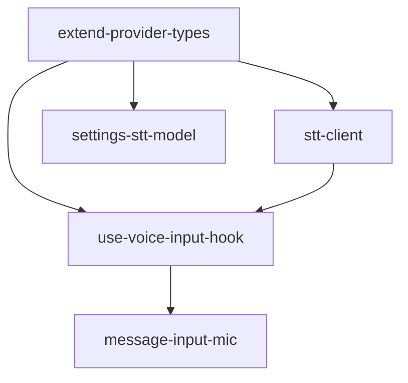

# DAG 任务图: Voice Input Mode

**日期:** 2026-06-24
**来源:** 技术方案 `2026-06-24-voice-input-mode-archi.md`

## 依赖图



## 任务列表

### Batch 1（无依赖，可并行）

| Task ID | Slug | 标题 | 类型 | 涉及模块 | 预估工时 |
|---------|------|------|------|----------|----------|
| T1 | extend-provider-types | 扩展 ProviderConfig / ProviderFormData 增加 sttModel 字段 | fullstack | shared/types, sidepanel/types | 0.5h |

### Batch 2（依赖 T1）

| Task ID | Slug | 标题 | 类型 | 依赖 | 涉及模块 | 预估工时 |
|---------|------|------|------|------|----------|----------|
| T2 | stt-client | 实现 SttClient 类 | backend | T1 | provider/ | 1.5h |
| T3 | settings-stt-model | SettingsPanel 增加 STT 模型输入框 | frontend | T1 | sidepanel/components/ | 1h |

### Batch 3（依赖 T1 + T2）

| Task ID | Slug | 标题 | 类型 | 依赖 | 涉及模块 | 预估工时 |
|---------|------|------|------|------|----------|----------|
| T4 | use-voice-input-hook | 实现 useVoiceInput hook（录音 + 转写编排） | frontend | T1, T2 | sidepanel/hooks/ | 2h |

### Batch 4（依赖 T4）

| Task ID | Slug | 标题 | 类型 | 依赖 | 涉及模块 | 预估工时 |
|---------|------|------|------|------|----------|----------|
| T5 | message-input-mic | MessageInput 集成麦克风按钮 + App 传参 | frontend | T4 | sidepanel/components/, sidepanel/App.tsx | 1.5h |

## 任务详情

### T1: 扩展 ProviderConfig / ProviderFormData 增加 sttModel 字段
- **Slug:** `extend-provider-types`
- **类型:** fullstack
- **依赖:** 无
- **涉及模块:** `src/shared/types/llm.ts`, `src/entrypoints/sidepanel/types.ts`
- **描述:**
  在 `ProviderConfig` 接口中新增可选字段 `sttModel?: string`，用于存储用户为每个 Provider 配置的语音转文字模型名称。
  在 `ProviderFormData` 接口中同步新增 `sttModel?: string` 字段，确保设置面板表单能编辑此字段。
- **验收标准:**
  - [ ] `ProviderConfig` 包含 `sttModel?: string` 字段
  - [ ] `ProviderFormData` 包含 `sttModel?: string` 字段
  - [ ] 类型扩展不破坏现有代码编译
  - [ ] 现有测试全部通过（`npx vitest run`）
- **输出文件:**
  - `src/shared/types/llm.ts`（修改）
  - `src/entrypoints/sidepanel/types.ts`（修改）

---

### T2: 实现 SttClient 类
- **Slug:** `stt-client`
- **类型:** backend（浏览器端 service）
- **依赖:** T1
- **涉及模块:** `src/provider/`
- **描述:**
  在 `src/provider/stt-client.ts` 中新建 `SttClient` 类，封装 OpenAI 兼容的 `/v1/audio/transcriptions` 端点。
  参考 `LlmClient` 的实现模式：
  - 构造函数接收 `ProviderConfig`
  - 私有 getter `apiUrl` 拼接 `/v1/audio/transcriptions`
  - 私有 getter `headers` 复用 `LlmClient` 的 header 模式（不含 `Content-Type`，由 `FormData` 自动设置）
  - `transcribe(audioBlob: Blob, externalSignal?: AbortSignal): Promise<string>` — 构建 `FormData`，包含 `file`（audioBlob）和 `model`（config.sttModel），发送 POST 请求，返回转写文本
  - 复用 `LlmClient.createTimeoutSignal` 的超时模式（或直接复制，避免循环依赖）
  - 错误处理：非 2xx 响应抛出包含状态码和 body 的 Error
  - 单元测试：mock fetch，覆盖成功、HTTP 错误、超时、AbortSignal 场景
- **验收标准:**
  - [ ] `SttClient` 类可实例化，构造函数接收 `ProviderConfig`
  - [ ] `transcribe()` 发送 POST 到 `{endpoint}/v1/audio/transcriptions`
  - [ ] FormData 包含 `file` 和 `model` 字段
  - [ ] 支持 `AbortSignal` 外部取消
  - [ ] 超时机制复用 `config.timeoutMs`，默认 120s
  - [ ] HTTP 错误抛出含状态码的 Error
  - [ ] 单元测试覆盖：成功返回文本、HTTP 4xx/5xx 错误、请求超时、外部 AbortSignal 取消
  - [ ] `src/provider/index.ts` 导出 `SttClient`
  - [ ] 现有测试全部通过
- **输出文件:**
  - `src/provider/stt-client.ts`（新建）
  - `src/provider/__tests__/stt-client.test.ts`（新建）
  - `src/provider/index.ts`（修改）

---

### T3: SettingsPanel 增加 STT 模型输入框
- **Slug:** `settings-stt-model`
- **类型:** frontend
- **依赖:** T1
- **涉及模块:** `src/entrypoints/sidepanel/components/SettingsPanel.tsx`
- **描述:**
  在 Provider 编辑表单中新增一个文本输入框，用于编辑 `sttModel` 字段。
  - 默认表单 `defaultForm` 增加 `sttModel: ''`
  - 编辑表单渲染区增加 `sttModel` 输入框（放在 `model` 输入框之后），`placeholder="语音模型 (e.g. whisper-1)"`
  - `handleSaveProvider` 中将 `editing.sttModel` 写入 `newProvider.sttModel`
  - "编辑" 按钮的 `setEditing` 中同步拷贝 `p.sttModel`
  - Provider 列表展示卡片中显示 `sttModel`（在 endpoint/model 行下方，仅当有值时显示）
  - 单元测试：验证 sttModel 输入框的渲染、编辑、保存、展示
- **验收标准:**
  - [ ] Provider 编辑表单包含 "语音模型" 输入框
  - [ ] 新增 Provider 时可填写 `sttModel`
  - [ ] 编辑已有 Provider 时可修改 `sttModel`
  - [ ] 保存后 `sttModel` 持久化到 ProviderConfig
  - [ ] Provider 列表卡片显示 `sttModel`（有值时）
  - [ ] 单元测试覆盖 sttModel 字段的 CRUD 流程
  - [ ] 现有测试全部通过
- **输出文件:**
  - `src/entrypoints/sidepanel/components/SettingsPanel.tsx`（修改）
  - `src/entrypoints/sidepanel/__tests__/SettingsPanel.test.tsx`（如不存在则新建，否则修改）

---

### T4: 实现 useVoiceInput hook
- **Slug:** `use-voice-input-hook`
- **类型:** frontend
- **依赖:** T1, T2
- **涉及模块:** `src/entrypoints/sidepanel/hooks/`
- **描述:**
  在 `src/entrypoints/sidepanel/hooks/useVoiceInput.ts` 中新建 `useVoiceInput` hook，封装完整的录音 → 转写生命周期。
  
  **状态机：**
  ```
  idle → requesting → recording → transcribing → idle（成功）
  idle → requesting → recording → idle（取消）
  idle → requesting → idle（权限拒绝）
  任意状态 → error → idle（调用 clearError）
  ```
  
  **核心逻辑：**
  1. `startRecording()`:
     - 遍历 `providers`，找到第一个 `sttModel` 不为空的 Provider
     - 若找不到，设置 `errorMessage = "未配置语音模型，请在设置中为 Provider 添加 sttModel"`
     - `voiceState → requesting`
     - 调用 `navigator.mediaDevices.getUserMedia({ audio: true })`
     - 权限拒绝时设置 error 并回到 idle
     - 创建 `MediaRecorder(stream, { mimeType: 'audio/webm' })`
     - 收集 `dataavailable` chunks 到数组
     - `voiceState → recording`
  2. `stopRecording()`:
     - 调用 `recorder.stop()`
     - 等待 `onstop` 事件后得到完整 Blob
     - `voiceState → transcribing`
     - `new SttClient(selectedProvider).transcribe(blob)`
     - 成功后调用 `onTranscribed(text)`
     - 失败后设置 `errorMessage`
     - `voiceState → idle`
     - 释放 stream tracks
  3. `cancelRecording()`:
     - 调用 `recorder.stop()`，但不触发转写
     - 释放 stream tracks
     - `voiceState → idle`
  
  **返回值接口：**
  ```typescript
  interface UseVoiceInputReturn {
    voiceState: 'idle' | 'requesting' | 'recording' | 'transcribing' | 'error';
    errorMessage: string | null;
    voiceAvailable: boolean; // navigator.mediaDevices 是否可用
    startRecording: () => Promise<void>;
    stopRecording: () => void;
    cancelRecording: () => void;
    clearError: () => void;
  }
  ```
  
  **测试：**
  - mock `navigator.mediaDevices.getUserMedia`
  - mock `MediaRecorder`（需要 mock 构造函数、start、stop、ondataavailable、onstop）
  - mock `SttClient.transcribe`
  - 覆盖：权限拒绝、录音成功→转写成功、录音取消、转写失败、无 sttModel 的 Provider
- **验收标准:**
  - [ ] `voiceAvailable` 反映 `navigator.mediaDevices` 可用性
  - [ ] `startRecording` 时状态机正确流转 `idle → requesting → recording`
  - [ ] 权限拒绝时回到 `idle` 并设置 `errorMessage`
  - [ ] 无 sttModel Provider 时设置 `errorMessage`
  - [ ] `stopRecording` 后调用 `SttClient.transcribe` 并回调 `onTranscribed`
  - [ ] `cancelRecording` 后不触发转写，释放 stream
  - [ ] 转写失败时进入 `error` 状态
  - [ ] `clearError` 回到 `idle`
  - [ ] 单元测试覆盖所有状态转换和异常路径
  - [ ] 现有测试全部通过
- **输出文件:**
  - `src/entrypoints/sidepanel/hooks/useVoiceInput.ts`（新建）
  - `src/entrypoints/sidepanel/hooks/__tests__/useVoiceInput.test.ts`（新建）

---

### T5: MessageInput 集成麦克风按钮 + App 传参
- **Slug:** `message-input-mic`
- **类型:** frontend
- **依赖:** T4
- **涉及模块:** `src/entrypoints/sidepanel/components/MessageInput.tsx`, `src/entrypoints/sidepanel/App.tsx`
- **描述:**
  **MessageInput 改造：**
  - Props 新增 `providers: ProviderConfig[]`
  - 引入 `useVoiceInput` hook
  - 在 textarea 左侧添加麦克风按钮：
    - `voiceState === 'idle'` 时显示 🎤 图标，点击触发 `startRecording()`
    - `voiceState === 'requesting'` 时显示加载动画
    - `voiceState === 'recording'` 时显示 🔴 红色录音指示，点击触发 `stopRecording()`
    - `voiceState === 'transcribing'` 时显示转圈动画，按钮 disabled
    - `voiceState === 'error'` 时显示 ⚠️，hover 显示 `errorMessage`
  - 转写成功后自动将文本填入 textarea（`onTranscribed` → `setText(text)`，追加模式）
  - 按钮整体位于 textarea 同一行左侧
  
  **App 改造：**
  - `MessageInput` 组件增加 `providers={providers}` props 传递
  
  **测试：**
  - mock `useVoiceInput` hook
  - 覆盖各状态下按钮渲染
  - 覆盖 `onTranscribed` 后 textarea 内容更新
  - 覆盖无 providers 时的表现
- **验收标准:**
  - [ ] MessageInput 左侧显示麦克风按钮
  - [ ] `idle` 状态点击触发录音
  - [ ] `recording` 状态显示红色指示，点击停止录音
  - [ ] `transcribing` 状态显示加载动画，按钮不可交互
  - [ ] `error` 状态显示错误图标
  - [ ] 转写成功后文本自动填入 textarea
  - [ ] App 正确传递 `providers` 给 MessageInput
  - [ ] 单元测试覆盖各状态和交互流程
  - [ ] 现有测试全部通过
- **输出文件:**
  - `src/entrypoints/sidepanel/components/MessageInput.tsx`（修改）
  - `src/entrypoints/sidepanel/__tests__/MessageInput.test.tsx`（修改）
  - `src/entrypoints/sidepanel/App.tsx`（修改）

---

## 循环依赖检查

✅ 未检测到循环依赖

## 执行建议

1. **T1 先行** — 类型扩展是阻塞性前置任务，0.5h 可完成
2. **T2 + T3 可并行** — 两者都只依赖 T1，互不依赖
3. **T4 依赖 T1+T2** — 需要类型定义和 SttClient 都就绪
4. **T5 收尾** — 依赖 T4 的 hook，是最终集成任务

总预估工时：6.5h（不含 review 和联调时间）
