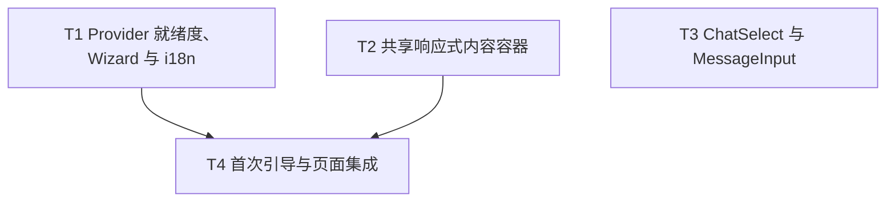

# 聊天首次体验与响应式布局 DAG

关联 Parent Issue: [#161](https://github.com/devcxl/browser-agent/issues/161)

## 并行关系

- T1、T2、T3 无前置依赖，可并行实施。
- T4 依赖 T1 和 T2；它在 `ChatLayout` 中接入就绪度状态机、首次引导和共享容器。
- T3 只替换 `MessageInput` 内部选择器，不依赖 T4；其 PR 可以独立合并。

## 无环检查

拓扑顺序为 `T1, T2, T3, T4`。所有依赖边均指向后续任务，不存在环形依赖。
