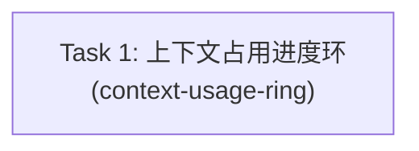

# 输入框上下文占用进度环 — DAG 任务依赖图

## 拓扑顺序

1. `context-usage-ring`（无前置依赖）

## 拆分说明

评估后**不拆分，保持单 Task**：

- **组件本体不构成独立 Task**：`ContextUsageRing` + `contextUsagePercent` + 组件测试（技术方案 §6.1–6.5）虽可单独通过测试，但没有任何真实渲染入口，UI 零可见变化——交付的是"通过测试的孤儿组件"而非端到端可观察行为，属于空壳 Task。
- **集成不可独立拆分**：MessageInput props / App 透传 / i18n / 集成测试（§6.6）依赖组件存在才能工作，拆开必然制造真实 blocking edge，而该依赖是人为的——拆成"零件 + 组装"即技术分层式拆分反模式（先建组件再接线）。
- **耦合度高**：全部文件共享同一数据契约（`used`/`limit` props、`tokenUsage`/`contextWindowTokens` props、`contextUsage.tooltip` i18n key），拆开需跨 Task 传递接口契约，无收益。
- **内聚且规模小**：6 个生产文件 + 2 个测试文件，技术方案 §9 明确建议单个垂直切片，一个 fresh-context developer 可独立完成。

## 任务列表

| # | Slug | 类型 | 依赖 |
|---|------|------|------|
| 1 | context-usage-ring | feature | — |
