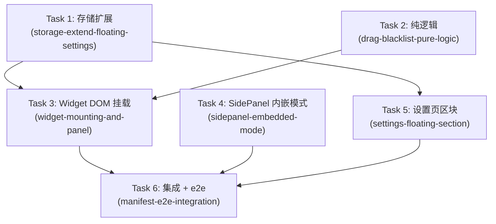

# 浮动聊天入口 — DAG 任务依赖图



## 批次执行计划

| Batch | 任务 | 可并行 | 类型 |
|-------|------|--------|------|
| 0 | T1, T2, T4 | ✅ | backend ×2, frontend |
| 1 | T3, T5 | ✅ (两者均依赖 T1 完成) | backend, frontend |
| 2 | T6 | 串行（依赖 T3+T4+T5 全部完成） | 集成 |

## 任务列表

| # | Slug | 标签 | 依赖 |
|---|------|------|------|
| 1 | storage-extend-floating-settings | backend | — |
| 2 | drag-blacklist-pure-logic | backend | — |
| 3 | widget-mounting-and-panel | backend | 1, 2 |
| 4 | sidepanel-embedded-mode | frontend | — |
| 5 | settings-floating-section | frontend | 1 |
| 6 | manifest-e2e-integration | backend, frontend | 3, 4, 5 |
```json
